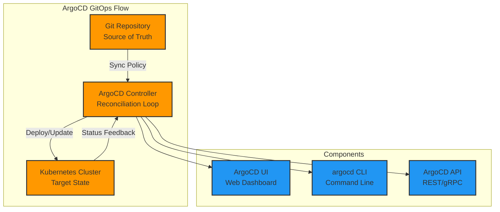

# 🏗️ ArgoCD Quick Start

> **GitOps Controller for Continuous Deployment**

## 🏛️ Architecture



## 🚀 Access ArgoCD

**URL:** https://argocd.local

**Default Credentials:**
```bash
# Username
echo "admin"

# Password  
kubectl -n argocd get secret argocd-initial-admin-secret \
  -o jsonpath="{.data.password}" | base64 -d && echo
```

## 📱 Applications

### Demo Application
- **Name:** `demo-apps`
- **Repository:** Current workspace GitOps configs
- **Path:** `ArgoCD-demo-apps/`
- **Namespace:** `demo-apps`

### Application Sets
- **Name:** `application-sets`  
- **Purpose:** Manages multiple applications from single configuration
- **Path:** `ArgoCD-demo-apps/applicationsets/`

## 🛠️ Configuration Files

```
ArgoCD/
├── configmap-cm.yaml      # ArgoCD server configuration
├── rbac-cm.yaml          # Role-based access control  
├── httproute.yaml        # Gateway API route
└── kustomization.yaml    # Kustomize manifest
```

## 📊 Monitoring

**Health Status:**
```bash
# Check ArgoCD components
kubectl get pods -n argocd

# Application sync status
kubectl get applications -n argocd

# Repository connection
argocd repo list
```

**Key Metrics:**
- Application sync frequency: `15s` (default)
- Health check interval: `5m`
- Auto-sync policy: Enabled for demo apps

## 🔧 Troubleshooting

**Common Issues:**

1. **Application OutOfSync:**
   ```bash
   # Force manual sync
   kubectl patch application demo-apps -n argocd \
     --type merge -p '{"metadata":{"annotations":{"argocd.argoproj.io/refresh":"hard"}}}'
   ```

2. **Repository Access:**
   ```bash
   # Check repo connection
   kubectl get secrets -n argocd | grep repo
   ```

3. **RBAC Issues:**
   ```bash
   # Check ArgoCD RBAC config
   kubectl get configmap argocd-rbac-cm -n argocd -o yaml
   ```

## 🔗 Useful Commands

```bash
# CLI Login
argocd login argocd.local --insecure

# List applications  
argocd app list

# Sync application
argocd app sync demo-apps

# Get application details
argocd app get demo-apps

# Set auto-sync
argocd app set demo-apps --sync-policy automated
```

## 📚 References

- [ArgoCD Documentation](https://argo-cd.readthedocs.io/)
- [GitOps Principles](https://www.weave.works/technologies/gitops/)
- [Kustomize Integration](https://argo-cd.readthedocs.io/en/stable/user-guide/kustomize/)
