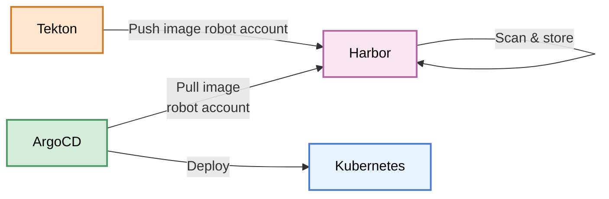
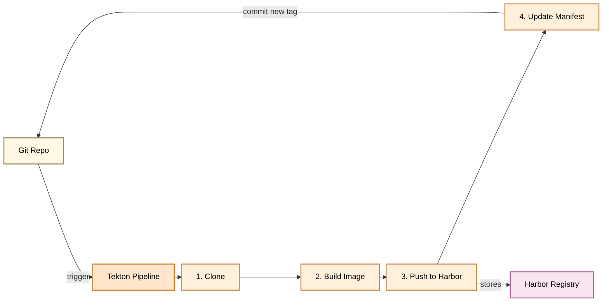
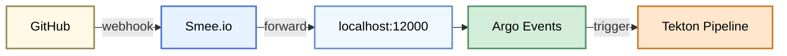
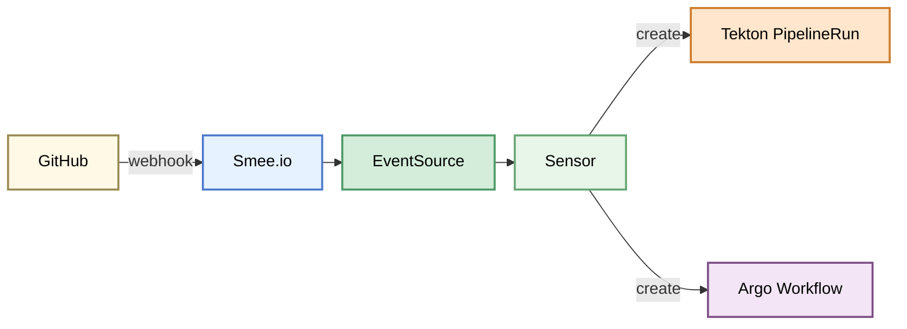

# Demo Overview

## GitOps Architecture Overview

This environment demonstrates a complete cloud-native GitOps platform running on a local Kubernetes cluster. Here's how each component contributes to the GitOps workflow:

### Infrastructure Layer

**Kind (Kubernetes in Docker)**

- Provides a lightweight local Kubernetes cluster for development and testing
- Runs entirely in Docker containers for easy setup and teardown

**Cilium (CNI)**

- Container Network Interface providing networking and security
- Enables pod-to-pod communication and network policies
- Provides observability through Hubble

**MetalLB**

- Bare-metal load balancer for local Kubernetes
- Assigns real IPs to LoadBalancer services in non-cloud environments
- Enables external access to cluster services

**Istio (Service Mesh + Gateway API)**

- Service mesh providing traffic management, security, and observability
- Gateway API implementation for ingress traffic routing
- HTTPRoute resources for declarative traffic routing
- Ambient mode support for sidecar-less service mesh

### Container Registry

**Harbor**

- Private container registry with vulnerability scanning
- Stores built container images from CI pipelines
- Integrates with Tekton for image push operations
- Provides image security and policy management

**Harbor Robot Accounts**

- Automated service accounts for programmatic registry access
- Used by Tekton pipelines to push built images
- Used by ArgoCD to pull images for deployment
- System-level permissions with scoped access controls
- Credentials stored securely in Kubernetes secrets



### Tekton CI Pipeline (Continuous Integration)

**Tekton**

- Cloud-native CI/CD pipeline engine
- Builds container images from source code
- Pushes images to Harbor registry
- Updates Git repository with new image tags
- Triggers GitOps workflow by committing manifest changes

**Tekton Pipelines** include:

- Clone repository task
- Build and push image task
- Update manifest with new image tag task



### GitOps Engine (Continuous Deployment)

**ArgoCD**

- GitOps continuous deployment tool
- Monitors Git repository for application manifests
- Automatically syncs Kubernetes state with Git (source of truth)
- Provides self-healing to revert manual cluster changes
- Web UI for visualizing deployment status

**ApplicationSets**

- Manages multiple applications from templates
- Enables deploying apps across namespaces/clusters
- Automatically generates ArgoCD Applications

### Event-Driven Automation

**Smee.io**

- Webhook forwarding service for local development
- Provides public URL that forwards to localhost
- Bridges GitHub webhooks to local cluster (port 12000)
- Enables real-time webhook delivery to Argo Events



**Argo Events**

- Event-based dependency manager for Kubernetes
- Listens to GitHub webhooks for repository changes (via Smee)
- Triggers Tekton pipelines on code commits
- Bridges external events to Kubernetes workflows

**Event Sources**: GitHub webhooks forwarded through Smee
**Sensors**: Trigger Tekton pipeline runs

**Argo Workflows**

- Workflow orchestration engine
- Runs complex multi-step workflows
- Can be triggered by Argo Events



### Observability

**Kiali**

- Service mesh observability console
- Visualizes Istio service mesh topology
- Shows traffic flow and service health

**Prometheus Stack**

- Metrics collection and alerting
- Monitors cluster and application health

### GitOps Workflow

1. **Developer pushes code** → GitHub repository
2. **GitHub sends webhook** → Smee.io channel
3. **Smee.io forwards** → Local cluster (localhost:12000)
4. **Argo Events** → Detects webhook and triggers Tekton Pipeline
5. **Tekton Pipeline** (using Harbor robot credentials):
   - Clones repository
   - Builds container image
   - Pushes image to Harbor registry
   - Updates manifest YAML with new image tag
   - Commits changes back to Git
6. **ArgoCD** (using Harbor robot credentials):
   - Detects manifest change in Git
   - Pulls new image from Harbor
   - Syncs new version to Kubernetes cluster
7. **Istio** → Routes traffic to new pods
8. **Kiali & Prometheus** → Monitor deployment health

This creates a fully automated GitOps loop where Git is the single source of truth, and all changes flow through version control with full audit trail. Smee enables local development by forwarding public webhooks to your local cluster.

---

## Demo Commands

```sh
# Toggle the self-heal & apply
kubectl apply -f ArgoCD-demo-apps/applicationsets/application-sets.yaml

# Patch Image live.
kubectl patch deployment -n demo-apps demo-app1 \\n  --type='json' \\n  -p='[{"op":"replace","path":"/spec/template/spec/containers/0/image","value":"nginx:stable-alpine3.23-perl"}]'\n

# Add and Remove from Istio mesh.
kubectl label namespace demo-apps istio.io/dataplane-mode=ambient --overwrite\n
history | grep  kubectl label namespace demo-apps istio.io/dataplane

# Demo of Kubernetes - general overview
https://www.theinfinity.dev/simulators/microservices

```
