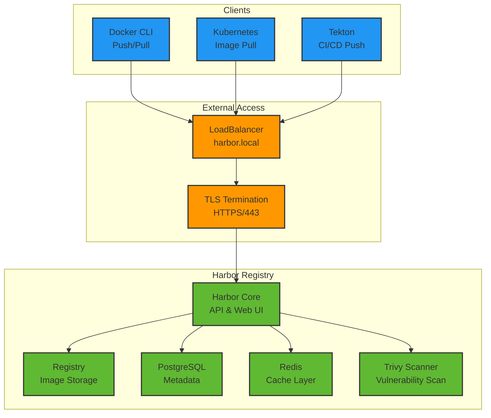

# 🐳 Harbor Quick Start

> **Enterprise Container Registry with Security Scanning**

## 🏛️ Architecture



## 🚀 Access Harbor

**URL:** https://harbor.local

**Default Credentials:**
- **Username:** `admin`
- **Password:** `Harbor12345`

## 📂 Projects & Repositories

### Default Projects
- **`library`** - Public project for demo applications
- **`tekton-builds`** - CI/CD build artifacts

### Repository Structure
```
harbor.local/
├── library/
│   └── demo-app:latest
└── tekton-builds/
    └── build-artifacts/
```

## 🛠️ Configuration Files

```
Harbor/
├── harbor-values.yaml     # Helm values configuration
└── harbor-httproute.yaml  # Gateway API route
```

## 🐳 Docker Integration

**Login to Harbor:**
```bash
# Login with default credentials
docker login harbor.local
# Username: admin
# Password: Harbor12345

# Or using environment variables
echo "Harbor12345" | docker login harbor.local -u admin --password-stdin
```

**Push/Pull Images:**
```bash
# Tag image for Harbor
docker tag my-app:latest harbor.local/library/my-app:latest

# Push to Harbor
docker push harbor.local/library/my-app:latest

# Pull from Harbor  
docker pull harbor.local/library/my-app:latest
```

## 🔐 Kubernetes Integration

**Registry Secret:**
```bash
# Create registry secret
kubectl create secret docker-registry harbor-regcred \
  --docker-server=harbor.local \
  --docker-username=admin \
  --docker-password=Harbor12345 \
  -n <your-namespace>

# Use in pod spec
apiVersion: v1
kind: Pod
spec:
  imagePullSecrets:
  - name: harbor-regcred
  containers:
  - name: app
    image: harbor.local/library/my-app:latest
```

## 🛡️ Security Features

### Vulnerability Scanning
- **Scanner:** Trivy (built-in)
- **Auto-scan:** Enabled on push
- **Policy enforcement:** Block vulnerable images

### Access Control
- **RBAC:** Role-based access control
- **Projects:** Isolated namespaces
- **Webhooks:** Integration with CI/CD

## 📊 Monitoring

**Health Check:**
```bash
# Check Harbor pods
kubectl get pods -n harbor

# Check Harbor services
kubectl get svc -n harbor

# Test API access
curl -k https://harbor.local/api/v2.0/systeminfo
```

**Storage Usage:**
```bash
# Check PVC usage
kubectl get pvc -n harbor

# Registry storage
kubectl exec -n harbor deploy/harbor-registry -- df -h /storage
```

## 🔧 Troubleshooting

**Common Issues:**

1. **Login Failed:**
   ```bash
   # Check credentials
   kubectl get secret harbor-admin-secret -n harbor -o yaml
   
   # Reset admin password
   kubectl exec -n harbor deploy/harbor-core -- harbor_passwd admin
   ```

2. **Image Push Failed:**
   ```bash
   # Check disk space
   kubectl get pvc -n harbor
   
   # Check registry logs
   kubectl logs -n harbor deploy/harbor-registry
   ```

3. **TLS Certificate Issues:**
   ```bash
   # Check certificate
   kubectl get secret harbor-tls -n harbor -o yaml
   
   # Verify certificate validity
   openssl x509 -in cert.pem -text -noout
   ```

## 🔗 API Usage

**API Authentication:**
```bash
# Get API token
curl -X POST "https://harbor.local/c/login" \
  -H "Content-Type: application/json" \
  -d '{"principal":"admin","password":"Harbor12345"}' \
  -c harbor-cookie.txt

# Use API with cookie
curl -b harbor-cookie.txt \
  "https://harbor.local/api/v2.0/projects"
```

## 📚 References

- [Harbor Documentation](https://goharbor.io/docs/)
- [Harbor API Reference](https://goharbor.io/docs/latest/build-customize-contribute/configure-swagger/)
- [Kubernetes Integration](https://goharbor.io/docs/latest/install-config/harbor-ha-helm/)
