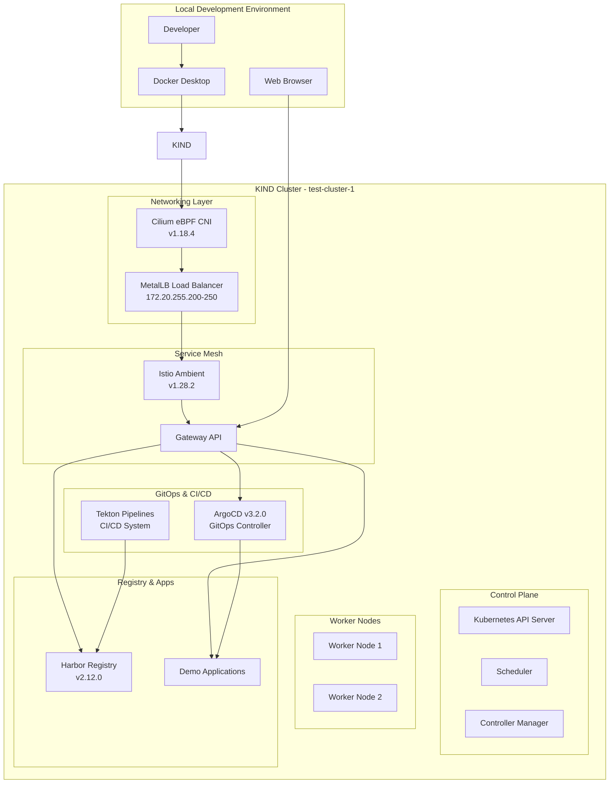

# GitOps Platform with KIND, Cilium, and Service Mesh

Complete local Kubernetes platform for development and testing with modern cloud-native tools.

[](https://www.yettel.bg/)
[](https://kind.sigs.k8s.io/)
[](https://kind.sigs.k8s.io/)
[](https://www.docker.com/)
[](https://cilium.io/)
[](https://istio.io/)
[](https://gateway-api.sigs.k8s.io/)
[](https://metallb.io/)
[](https://goharbor.io/)
[](https://tekton.dev/)
[](https://argo-cd.readthedocs.io/)

## Architecture



## Quick Start

1. **Prepare Docker Network**
   ```bash
   docker network inspect kind >/dev/null 2>&1 || \
   docker network create kind --subnet 172.20.0.0/16
   ```

2. **Deploy Platform**
   ```bash
   ./setup-kind-cilium-metallb-istio.sh
   ```

3. **Access Services**
   - ArgoCD: https://argocd.local (admin/admin)
   - Harbor: https://harbor.local (admin/Harbor12345)  
   - Demo App: https://demo-app1.local

## Components

| Component | Version | Purpose |
|-----------|---------|---------|
| KIND | v0.20.0 | Local Kubernetes cluster |
| Cilium | v1.18.4 | eBPF-based CNI networking |
| MetalLB | v0.14.5 | Load balancer for bare metal |
| Istio | v1.28.2 | Service mesh (Ambient mode) |
| ArgoCD | v3.2.0 | GitOps continuous delivery |
| Harbor | v2.12.0 | Container registry |
| Tekton | Latest | CI/CD pipelines |

## Network Configuration

- **Cluster Network**: 172.20.0.0/16
- **Load Balancer Pool**: 172.20.255.200-250
- **Service Mesh**: Gateway API with HTTPS termination

## Prerequisites

- Docker Desktop or Docker Engine
- kubectl CLI tool
- 8GB+ RAM available for cluster


## Create kind cluster with Cilium CNI

***Creation***

```sh
 kind create cluster --config=kind-config.yaml 
```

***Deletion***

```sh
kind delete cluster --name <cluster-name> 
```

***Customize your cluster***

[check page to create a config file kind-config.yaml](https://kind.sigs.k8s.io/docs/user/configuration/#a-note-on-cli-parameters-and-configuration-files)

### Install METAL_LB

```sh
# 1. Install MetalLB native mode
kubectl apply -f https://raw.githubusercontent.com/metallb/metallb/v0.14.5/config/manifests/metallb-native.yaml

# 2. Cilium CNI installation with kube-proxy replacement
cilium install \
  --version 1.18.4 \
  --set kubeProxyReplacement=true \
  --set kubeProxyReplacementMode=strict \
  --set cni.exclusive=false \
  --set ipam.mode=cluster-pool \
  --set ipam.operator.clusterPoolIPv4PodCIDRList=10.244.0.0/16 \
  --set k8s.requireIPv4PodCIDR=true

 cilium status --wait


# 3. Create a new IPAddressPool in the correct subnet:
# 4. Use an IP range from 172.20.0.0/16 that is not used by your nodes (e.g., 172.20.255.200-172.20.255.250):

cat <<EOF | kubectl apply -f -
apiVersion: metallb.io/v1beta1
kind: IPAddressPool
metadata:
  name: kind-pool
  namespace: metallb-system
spec:
  addresses:
  - 172.20.255.200-172.20.255.250
---
apiVersion: metallb.io/v1beta1
kind: L2Advertisement
metadata:
  name: l2adv
  namespace: metallb-system
spec:
  ipAddressPools:
  - kind-pool
   interfaces:
  - eth0
EOF
```

### Test

```sh
kubectl run -it --rm --image=busybox:1.28 testbox -- /bin/sh
# Inside the pod:
wget -O- http://foo-service:5678
wget -O- http://bar-service:8765

curl -v http://<foo-service-EXTERNAL-IP>:5678
curl -v http://<bar-service-EXTERNAL-IP>:8765
```

## Select Service mesh

```yaml
! Very Important Labeling for Istio***

- Istio Ambient: namespaces, labels, and why routing breaks without them
- What “Ambient Mesh” really means (important mental model)

- Istio Ambient does NOT inject sidecars.
- Instead, it uses node-level dataplane components:

***ztunnel (L4, mTLS, identity)***

- Waypoint proxies (L7, optional, per-namespace / per-service)
- Traffic only enters the mesh if the namespace is explicitly opted in.
- Why you created a dedicated gateway namespace
```

# Create the istio-gateway namespace and label it for ambient mode

```sh
kubectl create namespace istio-gateway
kubectl label namespace istio-gateway istio.io/dataplane-mode=ambient
```

```xml
***Diagram***

Namespace: istio-gateway
└── Labeled as "ambient"
    └── Traffic to/from pods in this namespace
        is intercepted by ztunnel
```

```sh
# REQUIRED: Istio will NOT create this namespace
kubectl create namespace istio-gateway || true
kubectl label namespace istio-gateway istio.io/dataplane-mode=ambient --overwrite

# Install Istio Ambient with istioctl
istioctl install \
  --set profile=ambient \
  --set 'components.ingressGateways[0].name=istio-ingressgateway' \
  --set 'components.ingressGateways[0].enabled=true' \
  --set 'components.ingressGateways[0].namespace=istio-gateway' \
  --skip-confirmation
```

***More on Istio***

- Istio [Install istioctl](https://istio.io/latest/docs/ambient/getting-started/#download-the-istio-cli)
- Istio [Install Istio over the Canal cni](https://medium.com/@SabujJanaCodes/touring-the-kubernetes-istio-ambient-mesh-part-1-setup-ztunnel-c80336fcfb2d)

## Apply GatewayApi sig

```sh
kubectl apply --server-side -f https://github.com/kubernetes-sigs/gateway-api/releases/download/v1.4.1/standard-install.yaml
```

## Add the TLS  from tls directory

- Create and apply `cert.pem` ànd  `key.pem`.

```sh
cd tls
# run the scripts with openssl
```

```yaml
***Architecture Diagram***  
+-------------------------------------------------------------+
|                        kind Cluster                         |
|                                                             |
|  +-------------------+      +---------------------------+   |
|  |   Node (Docker)   |      |   Node (Docker)           |   |
|  |                   |      |                           |   |
|  |  +-------------+  |      |  +-------------+          |   |
|  |  |   Pod(s)    |  |      |  |   Pod(s)    |          |   |
|  |  +-------------+  |      |  +-------------+          |   |
|  |      |   ^        |      |      |   ^                |   |
|  |      v   |        |      |      v   |                |   |
|  |  +-------------+  |      |  +-------------+          |   |
|  |  |   ztunnel   |  |      |  |   ztunnel   |          |   |
|  |  +-------------+  |      |  +-------------+          |   |
|  +-------------------+      +---------------------------+   |
|         |   ^                          |   ^                |
|         |   |                          |   |                |
|         v   |                          v   |                |
|  +-----------------------------------------------------+    |
|  |                MetalLB (LoadBalancer)               |    |
|  +-----------------------------------------------------+    |
|         |                                              |    |
|         v                                              v    |
|  +-----------------------------------------------------+    |
|  |           Istio Gateway (ambient, L4/L7)            |    |
|  +-----------------------------------------------------+    |
|                                                             |
+-------------------------------------------------------------+
```

***Legend:***

- Pod(s): Your workloads (no sidecars)
- ztunnel: L4 overlay, mTLS, identity (ambient mode)
- MetalLB: Provides external IPs for LoadBalancer services in kind
- Istio Gateway: Handles ingress/egress, runs in ambient mode (no sidecars)
- All networking is Cilium-powered (CNI)
- Traffic: Pod <-> ztunnel <-> Gateway <-> MetalLB <-> External

## Deploy httpbin (test app)

```sh
apiVersion: apps/v1
kind: Deployment
metadata:
  name: httpbin
  namespace: istio
spec:
  replicas: 1
  selector:
    matchLabels:
      app: httpbin
  template:
    metadata:
      labels:
        app: httpbin
    spec:
      containers:
      - name: httpbin
        image: postmanlabs/httpbin
        ports:
        - containerPort: 80
---
apiVersion: v1
kind: Service
metadata:
  name: httpbin
  namespace: istio
spec:
  selector:
    app: httpbin
  ports:
  - port: 80
    targetPort: 80
```

## Create TLS cert + secret

```sh
openssl req -x509 -nodes -days 365 \
  -newkey rsa:2048 \
  -subj "/CN=istio-gateway-istio.istio-gateway" \
  -keyout key.pem \
  -out cert.pem
# 
kubectl create secret tls istio-gateway-credentials \
  --cert=cert.pem \
  --key=key.pem \
  -n istio-gateway
```

## Gateway API (Gateway + HTTPRoute)

```sh

# Gateway
---
apiVersion: gateway.networking.k8s.io/v1
kind: Gateway
metadata:
  name: istio-gateway
  namespace: istio-gateway
spec:
  gatewayClassName: istio
  listeners:
  - name: http
    protocol: HTTP
    port: 80

  - name: https
    protocol: HTTPS
    port: 443
    hostname: istio-gateway-istio.istio-gateway
    tls:
      mode: Terminate
      certificateRefs:
      - kind: Secret
        name: istio-gateway-credentials
        namespace: istio-gateway

# Deploy HTTPRoute Deployment and service

---
apiVersion: apps/v1
kind: Deployment
metadata:
  name: httpbin
  namespace: default
spec:
  replicas: 1
  selector:
    matchLabels:
      app: httpbin
  template:
    metadata:
      labels:
        app: httpbin
    spec:
      containers:
      - name: httpbin
        image: postmanlabs/httpbin
        ports:
        - containerPort: 80
---
apiVersion: v1
kind: Service
metadata:
  name: httpbin
  namespace: default
spec:
  selector:
    app: httpbin
  ports:
  - port: 80
    targetPort: 80


# Apply
kubectl apply -f gateway.yaml
kubectl apply -f httpbin-test.yaml

```

## Verify services

```sh
kubectl get svc -n istio-gateway
```

## Test

```sh
# Test from inside cluster
kubectl run -it --rm testbox \
  --image=busybox:1.28 -- sh -lc \
  'wget -O- http://istio-gateway-istio.istio-gateway.svc.cluster.local/html'

# Test form host
curl -vk \
  --resolve istio-gateway-istio.istio-gateway:443:172.20.255.203 \
  https://istio-gateway-istio.istio-gateway/html

# Browser (HTTP)
http://172.20.255.203/html

# Browser (HTTPS)
https://172.20.255.203/html

(Expect cert warning — self-signed)

```
