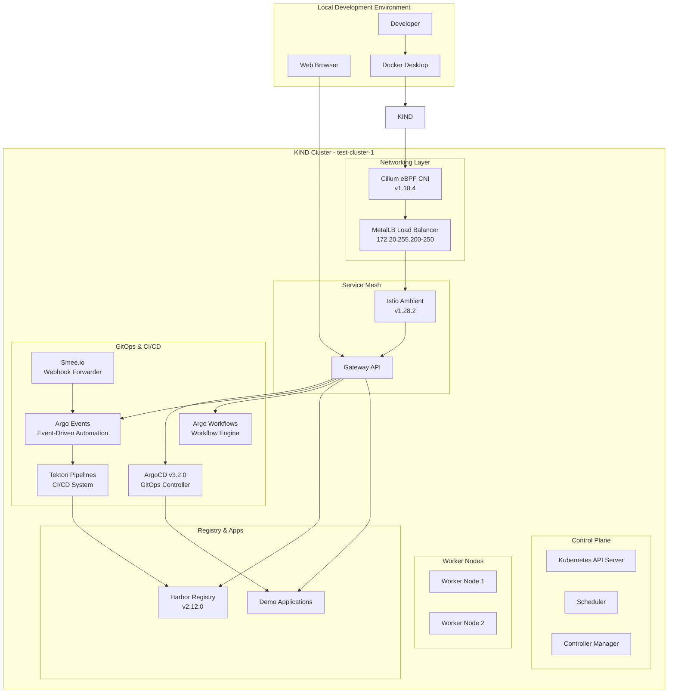
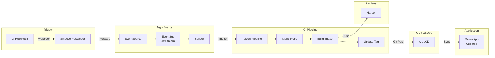

# GitOps Platform with KIND, Cilium, and Service Mesh

A complete local Kubernetes platform for development and testing with modern cloud-native tools including service mesh, GitOps, CI/CD, event-driven automation, and container registry.

[](https://www.yettel.bg/)
[](https://kind.sigs.k8s.io/)
[](https://kind.sigs.k8s.io/)
[](https://www.docker.com/)
[](https://cilium.io/)
[](https://istio.io/)
[](https://gateway-api.sigs.k8s.io/)
[](https://metallb.io/)
[](https://goharbor.io/)
[](https://tekton.dev/)
[](https://argo-cd.readthedocs.io/)
[](https://argoproj.github.io/argo-events/)
[](https://argoproj.github.io/argo-workflows/)

## 📖 Table of Contents

- [Project Description](#-project-description)
- [Architecture](#-architecture)
- [CI/CD Flow](#-cicd-flow)
- [Project Components](#-project-components)
- [Prerequisites](#-prerequisites)
- [Quick Start](#-quick-start)
- [Setup Script Details](#-setup-script-details)
- [Network Configuration](#-network-configuration)
- [Service Access](#-service-access)
- [Testing the Flow](#-testing-the-flow)
- [Detailed Guides](#-detailed-guides)

## 🚀 Project Description

This project provides a comprehensive local Kubernetes development platform that mimics production-grade cloud-native infrastructure. It combines modern technologies to create a fully-featured environment suitable for:

- **Cloud-Native Application Development**: Test applications in a realistic service mesh environment
- **GitOps Workflows**: Practice continuous deployment with ArgoCD
- **Event-Driven CI/CD**: Automated pipelines triggered by GitHub webhooks via Argo Events
- **CI/CD Pipeline Development**: Build and test Tekton pipelines
- **Container Registry Management**: Use Harbor for private image storage
- **Service Mesh Experimentation**: Explore Istio Ambient mode features
- **eBPF Networking**: Experience advanced networking with Cilium CNI

The platform is designed to be portable, reproducible, and easy to tear down and recreate, making it perfect for development, testing, and learning purposes.

## 🏗️ Architecture



## 🔄 CI/CD Flow

The platform implements a complete GitOps CI/CD pipeline:



**Flow Details:**
1. **GitHub Push** → Webhook sent to Smee.io channel
2. **Smee.io** → Forwards webhook to local port 12000
3. **Argo Events EventSource** → Receives webhook, publishes to EventBus
4. **Argo Events Sensor** → Triggers Tekton PipelineRun
5. **Tekton Pipeline** → Clones repo, builds image, pushes to Harbor, updates deployment tag
6. **ArgoCD** → Detects git changes, syncs application with new image tag

## 🧩 Project Components

| Component | Version | Purpose | Namespace |
|-----------|---------|---------|-----------|
| **KIND** | v0.20.0 | Local Kubernetes cluster | N/A |
| **Cilium** | v1.18.4 | eBPF-based CNI with kube-proxy replacement | kube-system |
| **MetalLB** | v0.14.5 | Load balancer for bare metal clusters | metallb-system |
| **Istio** | v1.28.2 | Service mesh in Ambient mode (no sidecars) | istio-system |
| **Gateway API** | v1.4.1 | Modern ingress and traffic management | N/A |
| **ArgoCD** | v3.2.0 | GitOps continuous delivery platform | argocd |
| **Argo Events** | Latest | Event-driven automation (webhooks) | argo-events |
| **Argo Workflows** | v3.6.2 | Workflow engine with UI | argo |
| **Harbor** | v2.12.0 | Enterprise container registry | harbor |
| **Tekton** | Latest | Cloud-native CI/CD pipelines | tekton-pipelines |

### Key Features
- **Zero-sidecar Service Mesh**: Istio Ambient mode provides mTLS and observability without pod overhead
- **eBPF Networking**: Cilium replaces kube-proxy with eBPF for better performance  
- **Local Load Balancer**: MetalLB provides LoadBalancer services in KIND
- **Modern Ingress**: Gateway API with HTTPS termination and TLS management
- **Complete GitOps**: ArgoCD with demo applications and ApplicationSets
- **Event-Driven CI/CD**: Argo Events + Smee.io triggers Tekton pipelines on GitHub webhooks
- **CI/CD Pipelines**: Tekton with Harbor registry integration

## 📋 Prerequisites

Before running the setup script, ensure you have:

- **Docker Desktop** or **Docker Engine** running
- **kubectl** CLI tool installed
- **kind** CLI tool installed  
- **cilium** CLI tool installed
- **istioctl** CLI tool installed
- **8GB+ RAM** available for the cluster
- **10GB+ disk space** for container images

### Install Required Tools

```bash
# Install kind
curl -Lo ./kind https://kind.sigs.k8s.io/dl/v0.20.0/kind-linux-amd64
chmod +x ./kind && sudo mv ./kind /usr/local/bin/kind

# Install cilium CLI
CILIUM_CLI_VERSION=$(curl -s https://raw.githubusercontent.com/cilium/cilium-cli/main/stable.txt)
curl -L --fail --remote-name-all https://github.com/cilium/cilium-cli/releases/download/${CILIUM_CLI_VERSION}/cilium-linux-amd64.tar.gz
tar xzvfC cilium-linux-amd64.tar.gz /usr/local/bin
rm cilium-linux-amd64.tar.gz

# Install istioctl
curl -L https://istio.io/downloadIstio | sh -
sudo mv istio-*/bin/istioctl /usr/local/bin/
```

## ⚡ Quick Start

The fastest way to get the entire platform running:

```bash
# 1. Clone the repository
git clone git@github.com:emilpeychev/kind-cluster-cilium.git
cd kind-cluster-cilium

# 2. Run the automated setup (all 11 steps)
./setup.sh all

# Or use interactive menu
./setup.sh
```

**⏱️ Setup time**: Approximately 12-15 minutes depending on internet speed

### Prerequisites

Install these tools before running:
```bash
# Required CLI tools
- docker
- kubectl
- kind
- cilium
- istioctl
- helm
- argocd
- smee-client (npm install -g smee-client)
```

## 🔧 Setup Script Details

The `setup.sh` script provides an interactive menu or can run all steps automatically:

```bash
./setup.sh           # Interactive menu
./setup.sh all       # Run all 11 steps
./setup.sh 1         # Run step 1 only
./setup.sh 1-5       # Run steps 1 through 5
./setup.sh 6 7 8     # Run steps 6, 7, and 8
./setup.sh delete    # Delete the cluster
```

### Installation Steps

| Step | Script | Component | Description |
|------|--------|-----------|-------------|
| 1 | `01-kind-cluster.sh` | KIND Cluster | 3-node cluster (1 control-plane, 2 workers) |
| 2 | `02-metallb.sh` | MetalLB | L2 load balancer (172.20.255.200-250) |
| 3 | `03-cilium.sh` | Cilium CNI | eBPF networking with kube-proxy replacement |
| 4 | `04-istio.sh` | Istio Ambient | Service mesh without sidecars |
| 5 | `05-tls-certs.sh` | TLS + CoreDNS | Local CA, certificates, DNS resolution |
| 6 | `06-harbor.sh` | Harbor Registry | Container registry at harbor.local |
| 7 | `07-tekton.sh` | Tekton Pipelines | CI/CD with clone-build-push pipeline |
| 8 | `08-argocd.sh` | ArgoCD | GitOps platform + initial image push |
| 9 | `09-argo-events.sh` | Argo Events | GitHub webhooks + smee forwarding |
| 10 | `10-argo-workflows.sh` | Argo Workflows | Workflow engine with UI |
| 11 | `11-deploy-apps.sh` | Deploy Apps | HTTPBin API and additional apps |

## 🌐 Network Configuration

### Cluster Networking
- **KIND Network**: 172.20.0.0/16 (Docker bridge network)
- **Pod CIDR**: 10.244.0.0/16 (Cilium cluster-pool IPAM)
- **Service CIDR**: 10.96.0.0/12 (Kubernetes default)

### Load Balancer Pool
- **MetalLB Range**: 172.20.255.200-172.20.255.250
- **Advertisement Mode**: Layer 2 (ARP-based)
- **Interface**: eth0 (container interface)

### Service Mesh
- **Data Plane**: Istio Ambient (ztunnel) - no sidecars
- **Gateway**: Dedicated namespace with LoadBalancer service
- **TLS**: Automated certificate management with local CA
- **Protocols**: HTTP/HTTPS with automatic redirect

## 🎯 Service Access

### Service URLs

| Service | URL | Credentials |
|---------|-----|-------------|
| ArgoCD | https://argocd.local | admin / `kubectl -n argocd get secret argocd-initial-admin-secret -o jsonpath='{.data.password}' \| base64 -d` |
| Harbor | https://harbor.local | admin / Harbor12345 |
| Tekton Dashboard | https://tekton.local | - |
| Argo Workflows | https://workflows.local | - |
| Demo App | https://demo-app1.local | - |
| HTTPBin API | https://httpbin.local | - |
| Webhooks | https://webhooks.local/github | - |

### Local DNS Setup
The setup scripts automatically add entries to `/etc/hosts`:
```bash
172.20.255.200  argocd.local harbor.local demo-app1.local tekton.local workflows.local webhooks.local httpbin.local
```

## 🧪 Testing the Flow

### Automatic Webhook Triggering

The platform uses Smee.io to forward GitHub webhooks to your local cluster:

```
GitHub Push → smee.io/1iIhi0YC0IolWxXJ → localhost:12000 → Argo Events → Tekton Pipeline
```

Simply push to master and watch the pipeline trigger automatically:

```bash
# Push a change and watch pipelines
git commit --allow-empty -m "Test webhook trigger"
git push origin master

# Watch pipeline runs
kubectl get pipelineruns -n tekton-builds -w
```

### Manual Webhook Test

```bash
# Trigger a build via webhook
curl -k -X POST https://webhooks.local/github \
  -H "Content-Type: application/json" \
  -H "X-GitHub-Event: push" \
  -d '{
    "ref": "refs/heads/master",
    "after": "test-commit-sha",
    "repository": {
      "name": "kind-cluster-cilium",
      "full_name": "emilpeychev/kind-cluster-cilium"
    }
  }'
```

### Monitor the Pipeline
```bash
# Watch Tekton pipeline runs
kubectl get pipelineruns -n tekton-builds -w

# Check Argo Events sensor logs
kubectl logs -n argo-events -l sensor-name=github-tekton --tail=20

# View in Tekton Dashboard
open https://tekton.local
```

### Check Harbor for New Image
```bash
# List images in Harbor
curl -k -s -u admin:Harbor12345 https://harbor.local/api/v2.0/projects/library/repositories/demo-app/artifacts | jq '.[].tags[].name'
```

## � Troubleshooting

### Tekton Pipeline Not Triggering on Push

If you push to GitHub but no Tekton pipeline starts:

**1. Check if Smee client is running and responsive:**
```bash
ps aux | grep smee
```

**2. Restart Smee client (most common fix):**
```bash
pkill -f smee
smee --url https://smee.io/1iIhi0YC0IolWxXJ --target http://localhost:12000/github &
```

**3. Check if port-forward is running:**
```bash
ps aux | grep "port-forward.*12000"
# If not running, restart it:
kubectl port-forward -n argo-events svc/github-eventsource-svc 12000:12000 &
```

**4. Verify webhook is received by EventSource:**
```bash
kubectl logs -n argo-events -l eventsource-name=github --tail=10 --since=2m
```

**5. Check Sensor logs for filtering issues:**
```bash
kubectl logs -n argo-events -l sensor-name=github-tekton --tail=20
```

**6. Verify GitHub webhook configuration:**
- Go to: https://github.com/emilpeychev/kind-cluster-cilium/settings/hooks
- Check **Recent Deliveries** - should show green checkmarks
- Payload URL should be: `https://smee.io/1iIhi0YC0IolWxXJ`
- Content type: `application/json`
- Secret: leave empty (Smee doesn't support secrets)

### Image Pull Errors

If pods show `ImagePullBackOff` or `ErrImagePull`:

**1. Check what tag the deployment wants vs what Harbor has:**
```bash
# What deployment wants:
kubectl get deployment demo-app1 -n demo-apps -o jsonpath='{.spec.template.spec.containers[0].image}'

# What Harbor has:
curl -sk -u admin:Harbor12345 https://harbor.local/api/v2.0/projects/library/repositories/demo-app/artifacts | jq -r '.[].tags[].name'
```

**2. Push missing image tag:**
```bash
# Replace TAG with the tag deployment needs
docker tag nginx:trixie-perl harbor.local/library/demo-app:TAG
docker push harbor.local/library/demo-app:TAG
```

**3. Restart the deployment:**
```bash
kubectl rollout restart deployment/demo-app1 -n demo-apps
```

### Quick Health Check
```bash
# All services running
kubectl get pods -n argo-events
kubectl get pods -n tekton-pipelines
kubectl get pods -n tekton-builds

# Recent pipeline runs
kubectl get pipelineruns -n tekton-builds --sort-by=.metadata.creationTimestamp | tail -5
```

## �📚 Detailed Guides

For in-depth information about specific components:

- **[Gateway API Guide](z-Guides/Gateway-API-Guide.md)** - Modern ingress and routing  
- **[ArgoCD Setup](ArgoCD/z-Quick-Start.md)** - GitOps workflow and applications
- **[Argo Events Integration](ArgoCD-Events/README.md)** - Event-driven automation setup
- **[Harbor Registry](Harbor/z-Quick-Start.md)** - Container registry management
- **[Tekton Pipelines](Tekton-Pipelines/z-Tekton-Pipeline-Details.md)** - CI/CD pipeline development
- **[TLS Management](tls/z-tls.md)** - Certificate authority and TLS setup
- **[MetalLB Setup](metalLB/z-Quick-Start.md)** - Load balancer configuration

## 📁 Repository Structure

```
├── setup.sh                             # Main setup script (interactive menu)
├── kind-config.yaml                     # KIND cluster configuration
├── install-kind-cluster/                # Individual setup scripts (01-11)
│   ├── 01-kind-cluster.sh
│   ├── 02-metallb.sh
│   ├── 03-cilium.sh
│   ├── 04-istio.sh
│   ├── 05-tls-certs.sh
│   ├── 06-harbor.sh
│   ├── 07-tekton.sh
│   ├── 08-argocd.sh
│   ├── 09-argo-events.sh
│   ├── 10-argo-workflows.sh
│   ├── 11-deploy-apps.sh
│   └── lib.sh
├── ArgoCD/                              # ArgoCD configs
├── ArgoCD-demo-apps/                    # Demo applications for GitOps
│   ├── apps/                            # Main demo app (nginx-demos)
│   ├── api/                             # HTTPBin API app
│   ├── applicationsets/                 # ArgoCD ApplicationSets
│   └── projects/                        # ArgoCD Projects
├── ArgoCD-Events/                       # Argo Events (webhooks, sensors)
├── Argo-Workflows/                      # Argo Workflows UI HTTPRoute
├── Harbor/                              # Harbor registry configs
├── Tekton/                              # Tekton dashboard HTTPRoute
├── Tekton-Pipelines/                    # CI/CD pipeline definitions
├── metalLB/                             # MetalLB configuration
├── tls/                                 # TLS certificates and CA
├── demo-app/                            # Demo app source (Dockerfile, index.html)
└── z-Guides/                            # Documentation guides
```

---

🎉 **Ready to explore modern cloud-native development!** The platform provides a production-like environment for learning and testing Kubernetes, service mesh, GitOps, event-driven automation, and CI/CD workflows.