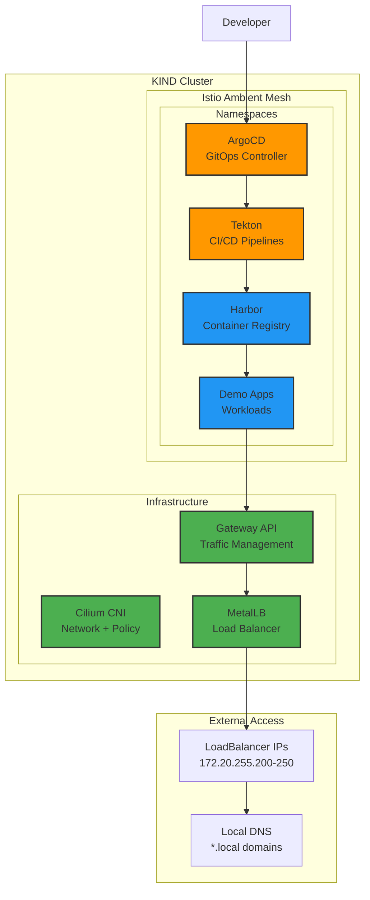
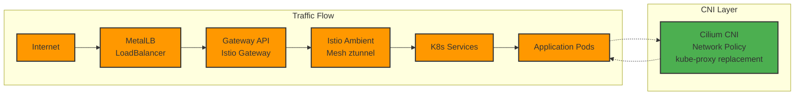

# 🚀 GitOps Platform on KIND

> **Complete Kubernetes Development Platform with Cilium CNI, Istio Ambient Mesh & GitOps Toolchain**

[](https://www.yettel.bg/)
[](https://kind.sigs.k8s.io/)
[](https://cilium.io/)
[](https://istio.io/)
[](https://goharbor.io/)
[](https://tekton.dev/)
[](https://argo-cd.readthedocs.io/)

## 🏗️ Architecture Overview



## 🚀 Quick Start

**Prerequisites:**
- Docker with KIND network: `172.20.0.0/16`
- kubectl, kind, helm, istioctl installed

**One-Command Deployment:**
```bash
./setup-kind-cilium-metallb-istio.sh
```

**Manual Setup:**
```bash
# 1. Create KIND network
docker network inspect kind >/dev/null 2>&1 || \
docker network create kind --subnet 172.20.0.0/16

# 2. Create cluster
kind create cluster --config=kind-config.yaml 

# 3. Run platform setup
./setup-kind-cilium-metallb-istio.sh
```

## 🧪 Testing & Validation

```bash
./test-platform.sh    # Comprehensive automated tests (40+ checks)
./health-check.sh      # Quick health verification  
./manual-tests.sh      # Interactive testing
```

## 📁 Project Structure

```
├── 📄 setup-kind-cilium-metallb-istio.sh  # Main setup script
├── 🧪 test-platform.sh                    # Automated testing
├── ⚙️  kind-config.yaml                   # KIND cluster config
├── 🏗️  ArgoCD/                           # GitOps controller
├── 🐳 Harbor/                             # Container registry  
├── 🔄 Tekton-Pipelines/                   # CI/CD pipelines
├── 🎯 ArgoCD-demo-apps/                   # Demo applications
├── 🌐 metalLB/                           # Load balancer config
└── 🔐 tls/                               # TLS certificates
```

## 🔗 Access URLs

| Service | URL | Credentials |
|---------|-----|-------------|
| ArgoCD | https://argocd.local | admin / kubectl -n argocd get secret argocd-initial-admin-secret -o jsonpath="{.data.password}" \| base64 -d |
| Harbor | https://harbor.local | admin / Harbor12345 |  
| Tekton Dashboard | https://tekton-dashboard.local | - |
| Demo App | https://demo-app1.local | - |

> **Note:** Add these domains to `/etc/hosts` pointing to your LoadBalancer IP

## 🏛️ Core Components

### **Networking Stack**



### **GitOps Workflow**

```mermaid
graph TD
    DEV[Developer<br/>git push] --> GIT[Git Repository]
    GIT --> ARG[ArgoCD<br/>GitOps Sync]
    ARG --> APP[Applications<br/>Deployment]
    
    DEV --> TEK[Tekton Pipeline<br/>CI Build]
    TEK --> HAR[Harbor Registry<br/>Push Image]  
    HAR --> ARG
    
    classDef dev fill:#2196f3,stroke:#333,stroke-width:2px
    classDef cicd fill:#ff9800,stroke:#333,stroke-width:2px
    classDef app fill:#4caf50,stroke:#333,stroke-width:2px
    
    class DEV,GIT dev
    class TEK,HAR,ARG cicd  
    class APP app
```

## 🛠️ Component Details

| Component | Version | Purpose | Namespace |
|-----------|---------|---------|-----------|
| **KIND** | v0.20.0 | Local K8s cluster | - |
| **Cilium** | v1.18.4 | CNI + kube-proxy replacement | cilium-system |
| **MetalLB** | v0.14.5 | LoadBalancer provider | metallb-system |
| **Istio** | v1.28.2 | Ambient service mesh | istio-system |
| **Harbor** | v2.12.0 | Container registry | harbor |
| **ArgoCD** | v3.2.0 | GitOps controller | argocd |
| **Tekton** | Latest | CI/CD pipelines | tekton-system |

## 🔧 Troubleshooting

**Common Issues:**

1. **LoadBalancer stuck in Pending:**
   - Check MetalLB configuration: `kubectl get ipaddresspool -n metallb-system`
   - Verify Docker network: `docker network inspect kind`

2. **Services unreachable:**
   - Check DNS entries in `/etc/hosts`
   - Verify Gateway routes: `kubectl get httproute -A`

3. **ArgoCD apps out of sync:**
   - Force sync: `kubectl patch application <app> -n argocd --type merge -p '{"spec":{"syncPolicy":{"automated":null}}}'`

4. **Harbor registry issues:**
   - Check certificates: `kubectl get secret -n harbor`
   - Verify external access: `curl -k https://harbor.local`

## 📚 Documentation

- [ArgoCD Quick Start](ArgoCD/Quick-Start.md)
- [Harbor Quick Start](Harbor/Quick-Start.md)  
- [Tekton Quick Start](Tekton/Quick-Start.md)
- [TLS Configuration](tls/tls.md)

## 🗑️ Cleanup

```bash
# Delete cluster
kind delete cluster --name test-cluster-1

# Remove Docker network (optional)
docker network rm kind
```

## 🤝 Contributing

1. Fork the repository
2. Create your feature branch: `git checkout -b feature/amazing-feature`
3. Test thoroughly: `./test-platform.sh`
4. Commit changes: `git commit -m 'Add amazing feature'`
5. Push to branch: `git push origin feature/amazing-feature`
6. Open a Pull Request
