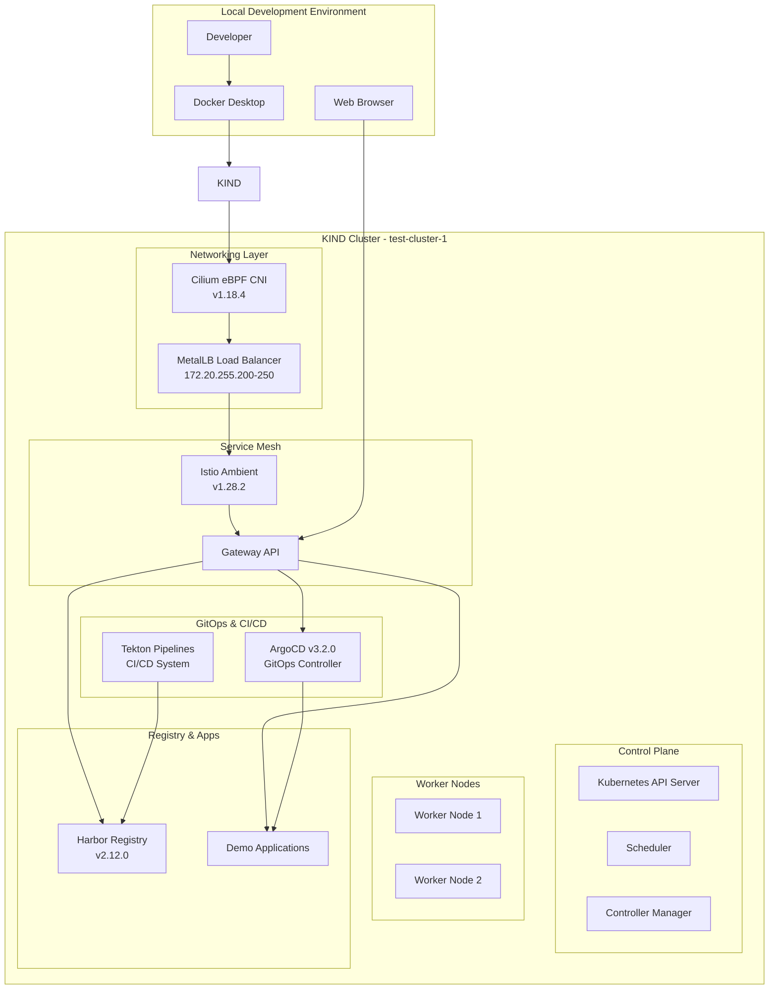

# GitOps Platform with KIND, Cilium, and Service Mesh

A complete local Kubernetes platform for development and testing with modern cloud-native tools including service mesh, GitOps, CI/CD, and container registry.

[](https://www.yettel.bg/)
[](https://kind.sigs.k8s.io/)
[](https://kind.sigs.k8s.io/)
[](https://www.docker.com/)
[](https://cilium.io/)
[](https://istio.io/)
[](https://gateway-api.sigs.k8s.io/)
[](https://metallb.io/)
[](https://goharbor.io/)
[](https://tekton.dev/)
[](https://argo-cd.readthedocs.io/)

## 📖 Table of Contents

- [Project Description](#-project-description)
- [Architecture](#-architecture)
- [Project Components](#-project-components)
- [Prerequisites](#-prerequisites)
- [Quick Start](#-quick-start)
- [Setup Script Details](#-setup-script-details)
- [Network Configuration](#-network-configuration)
- [Service Access](#-service-access)
- [Detailed Guides](#-detailed-guides)

## 🚀 Project Description

This project provides a comprehensive local Kubernetes development platform that mimics production-grade cloud-native infrastructure. It combines modern technologies to create a fully-featured environment suitable for:

- **Cloud-Native Application Development**: Test applications in a realistic service mesh environment
- **GitOps Workflows**: Practice continuous deployment with ArgoCD
- **CI/CD Pipeline Development**: Build and test Tekton pipelines
- **Container Registry Management**: Use Harbor for private image storage
- **Service Mesh Experimentation**: Explore Istio Ambient mode features
- **eBPF Networking**: Experience advanced networking with Cilium CNI

The platform is designed to be portable, reproducible, and easy to tear down and recreate, making it perfect for development, testing, and learning purposes.

## 🏗️ Architecture



## 🧩 Project Components

| Component | Version | Purpose | Namespace |
|-----------|---------|---------|-----------|
| **KIND** | v0.20.0 | Local Kubernetes cluster | N/A |
| **Cilium** | v1.18.4 | eBPF-based CNI with kube-proxy replacement | kube-system |
| **MetalLB** | v0.14.5 | Load balancer for bare metal clusters | metallb-system |
| **Istio** | v1.28.2 | Service mesh in Ambient mode (no sidecars) | istio-system |
| **Gateway API** | v1.4.1 | Modern ingress and traffic management | N/A |
| **ArgoCD** | v3.2.0 | GitOps continuous delivery platform | argocd |
| **Harbor** | v2.12.0 | Enterprise container registry | harbor |
| **Tekton** | Latest | Cloud-native CI/CD pipelines | tekton-pipelines |
| **Kubernetes Dashboard** | Latest | Web-based cluster management UI | kubernetes-dashboard |

### Key Features
- **Zero-sidecar Service Mesh**: Istio Ambient mode provides mTLS and observability without pod overhead
- **eBPF Networking**: Cilium replaces kube-proxy with eBPF for better performance  
- **Local Load Balancer**: MetalLB provides LoadBalancer services in KIND
- **Modern Ingress**: Gateway API with HTTPS termination and TLS management
- **Complete GitOps**: ArgoCD with demo applications and ApplicationSets
- **CI/CD Pipelines**: Tekton with Harbor registry integration

## 📋 Prerequisites

Before running the setup script, ensure you have:

- **Docker Desktop** or **Docker Engine** running
- **kubectl** CLI tool installed
- **kind** CLI tool installed  
- **cilium** CLI tool installed
- **istioctl** CLI tool installed
- **8GB+ RAM** available for the cluster
- **10GB+ disk space** for container images

### Install Required Tools

```bash
# Install kind
curl -Lo ./kind https://kind.sigs.k8s.io/dl/v0.20.0/kind-linux-amd64
chmod +x ./kind && sudo mv ./kind /usr/local/bin/kind

# Install cilium CLI
CILIUM_CLI_VERSION=$(curl -s https://raw.githubusercontent.com/cilium/cilium-cli/main/stable.txt)
curl -L --fail --remote-name-all https://github.com/cilium/cilium-cli/releases/download/${CILIUM_CLI_VERSION}/cilium-linux-amd64.tar.gz
tar xzvfC cilium-linux-amd64.tar.gz /usr/local/bin
rm cilium-linux-amd64.tar.gz

# Install istioctl
curl -L https://istio.io/downloadIstio | sh -
sudo mv istio-*/bin/istioctl /usr/local/bin/
```

## ⚡ Quick Start

The fastest way to get the entire platform running:

```bash
# 1. Clone the repository
git clone <repository-url>
cd Kind-cluster-cilium

# 2. Make setup script executable
chmod +x setup-kind-cilium-metallb-istio.sh

# 3. Run the automated setup
./setup-kind-cilium-metallb-istio.sh
```

**⏱️ Setup time**: Approximately 10-15 minutes depending on internet speed

## 🔧 Setup Script Details

The `setup-kind-cilium-metallb-istio.sh` script automates the complete platform deployment. Here's what it does:

### Phase 1: Infrastructure Setup
1. **Docker Network**: Creates `kind` network with subnet `172.20.0.0/16`
2. **KIND Cluster**: Deploys 3-node cluster (1 control-plane, 2 workers) using `kind-config.yaml`
3. **MetalLB**: Installs native MetalLB load balancer

### Phase 2: Networking Layer  
4. **Cilium CNI**: Installs with kube-proxy replacement and eBPF mode
   - Cluster pool IPAM: `10.244.0.0/16`
   - Strict kube-proxy replacement enabled
5. **MetalLB Pool**: Configures L2 advertisement for IP range `172.20.255.200-250`

### Phase 3: Service Mesh & Ingress
6. **Gateway API**: Installs CRDs for modern ingress management
7. **Istio Namespace**: Creates `istio-gateway` namespace with ambient mode labels
8. **Istio Ambient**: Deploys service mesh without sidecars
   - ztunnel for L4 mTLS and identity
   - Ingress gateway in `istio-gateway` namespace

### Phase 4: Certificate Management
9. **Local CA**: Generates self-signed Certificate Authority for HTTPS
10. **Gateway Certificates**: Creates signed certificates for gateway services
11. **TLS Secrets**: Stores certificates in Kubernetes secrets

### Phase 5: Platform Services
12. **Harbor Registry**: Deploys with HTTPS endpoint at `harbor.local`
13. **ArgoCD**: Installs GitOps platform at `argocd.local`
14. **Tekton Pipelines**: Sets up CI/CD system with demo pipelines
15. **Demo Applications**: Deploys sample apps with HTTPRoutes

### Script Verification
The script includes multiple verification steps:
- Service readiness checks
- Pod status validation  
- TLS certificate verification
- Gateway connectivity tests

### Generated Endpoints
After successful completion, you'll have access to:
- **ArgoCD**: https://argocd.local (admin/admin)
- **Harbor**: https://harbor.local (admin/Harbor12345)  
- **Demo App**: https://demo-app1.local
- **Tekton Dashboard**: https://tekton-dashboard.local
- **Kubernetes Dashboard**: via kubectl proxy

## 🌐 Network Configuration

### Cluster Networking
- **KIND Network**: 172.20.0.0/16 (Docker bridge network)
- **Pod CIDR**: 10.244.0.0/16 (Cilium cluster-pool IPAM)
- **Service CIDR**: 10.96.0.0/12 (Kubernetes default)

### Load Balancer Pool
- **MetalLB Range**: 172.20.255.200-172.20.255.250
- **Advertisement Mode**: Layer 2 (ARP-based)
- **Interface**: eth0 (container interface)

### Service Mesh
- **Data Plane**: Istio Ambient (ztunnel) - no sidecars
- **Gateway**: Dedicated namespace with LoadBalancer service
- **TLS**: Automated certificate management with local CA
- **Protocols**: HTTP/HTTPS with automatic redirect

## 🎯 Service Access

### Local DNS Setup (Recommended)
Add entries to your `/etc/hosts` file:
```bash
# Get LoadBalancer IP
kubectl get svc -n istio-gateway

# Add to /etc/hosts (replace with actual IP)
172.20.255.201  argocd.local harbor.local demo-app1.local tekton-dashboard.local
```

### Direct IP Access
Services are also accessible via their LoadBalancer IPs:
```bash
# List all LoadBalancer services  
kubectl get svc --all-namespaces -o wide | grep LoadBalancer
```

## 📚 Detailed Guides

For in-depth information about specific components:

- **[KIND Configuration](z-Quick-Start-KIND.md)** - Cluster setup and configuration
- **[Gateway API Guide](Gateway-API-Guide.md)** - Modern ingress and routing  
- **[ArgoCD Setup](ArgoCD/Quick-Start.md)** - GitOps workflow and applications
- **[Harbor Registry](Harbor/Quick-Start.md)** - Container registry management
- **[Tekton Pipelines](Tekton-Pipelines/z-Tekton-Pipeline-Details.md)** - CI/CD pipeline development
- **[TLS Management](tls/z-tls.md)** - Certificate authority and TLS setup
- **[Cilium CNI](z-cni/cilium/cilium-installation.md)** - eBPF networking configuration
- **[MetalLB Setup](metalLB/z-Quick-Start.md)** - Load balancer configuration

---

🎉 **Ready to explore modern cloud-native development!** The platform provides a production-like environment for learning and testing Kubernetes, service mesh, GitOps, and CI/CD workflows.