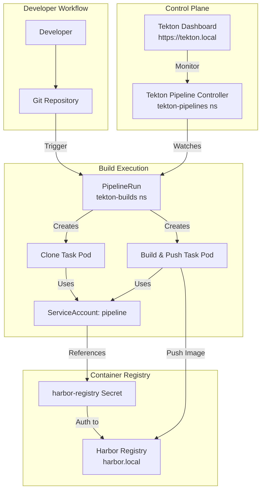
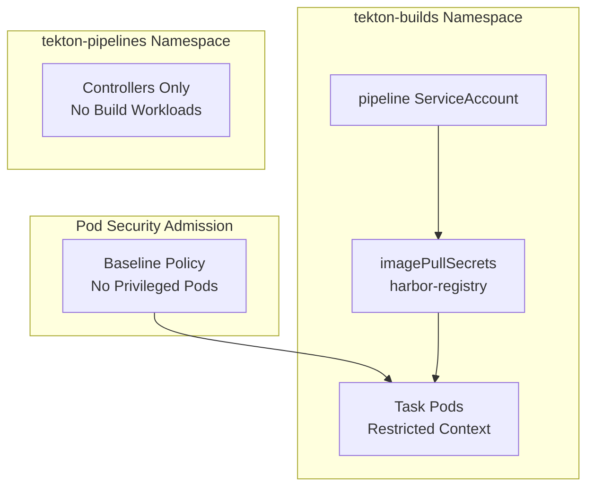
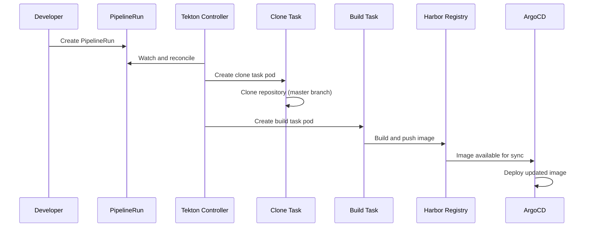

# Tekton Pipelines Detailed Architecture

## Overview
Tekton Pipelines provides Kubernetes-native CI/CD with strict security boundaries, integrated with Harbor registry, Istio mesh, and Pod Security Admission controls.

## Architecture Overview


## Security Architecture


## Namespace Architecture

### tekton-pipelines (Control Plane)
- **Purpose**: Tekton controllers and system components
- **Workloads**: Controllers only, no builds
- **Configuration**: `set-security-context=true` feature flag
- **Access**: Internal cluster components

### tekton-builds (Execution Plane)
- **Purpose**: All CI/CD build workloads
- **Security**: Pod Security Admission baseline enforcement
- **ServiceAccount**: `pipeline` with Harbor registry access
- **Labels**:
  ```yaml
  pod-security.kubernetes.io/enforce: baseline
  pod-security.kubernetes.io/audit: baseline
  pod-security.kubernetes.io/warn: baseline
  ```

## Pipeline Execution Flow


## Registry Integration

### Harbor Authentication
```yaml
apiVersion: v1
kind: Secret
metadata:
  name: harbor-registry
  namespace: tekton-builds
type: kubernetes.io/dockerconfigjson
data:
  .dockerconfigjson: <base64-encoded-config>
```

### ServiceAccount Configuration
```yaml
apiVersion: v1
kind: ServiceAccount
metadata:
  name: pipeline
  namespace: tekton-builds
imagePullSecrets:
  - name: harbor-registry
```

## Dashboard Access
- **URL**: https://tekton.local
- **Exposure**: Istio Gateway with HTTPRoute
- **Authentication**: Cluster RBAC integration
- **Features**: Pipeline monitoring, logs, status tracking

## Pipeline Components

### Tasks Available
- **Clone Repository**: Fetches source code from Git
- **Build & Push**: Builds Docker image and pushes to Harbor
- **Security Scanning**: Optional vulnerability assessment

### Current Pipeline
- **Source**: GitHub repository (master branch)
- **Build**: Docker multi-stage build
- **Registry**: Harbor at `harbor.local`
- **Deployment**: ArgoCD GitOps synchronization

## Security Features

### Pod Security Standards
- **Baseline Enforcement**: Prevents privileged containers
- **Security Context**: Automatically applied by Tekton
- **Resource Limits**: CPU and memory constraints
- **Network Policies**: Future Cilium integration

### RBAC Model
- **Namespace Isolation**: Strict boundaries between control and execution
- **ServiceAccount Scoping**: Minimal required permissions
- **Registry Access**: Secured with pull/push secrets

## Best Practices

### Pipeline Design
1. **Always specify ServiceAccount** in PipelineRuns
2. **Use tekton-builds namespace** for all build workloads
3. **Maintain PSA compliance** - no privileged containers
4. **Separate concerns** - control plane vs execution plane

### Security Guidelines
1. **Never weaken PSA policies** for convenience
2. **Create dedicated namespaces** for privileged workloads if needed
3. **Regularly rotate registry credentials**
4. **Monitor pipeline resource usage**

## Integration Points
- **Git Repository**: Source code and pipeline definitions
- **Harbor Registry**: Container image storage and scanning
- **ArgoCD**: Automated deployment synchronization
- **Istio Gateway**: Secure dashboard access
- **Cilium CNI**: Network policy enforcement

## Troubleshooting

### Common Issues
- **Pipeline not starting**: Check ServiceAccount and RBAC
- **Image pull failures**: Verify harbor-registry secret
- **PSA violations**: Review task security contexts
- **Network connectivity**: Validate Cilium network policies

```

---

## Namespaces

### tekton-pipelines

Purpose:

* Hosts Tekton controllers and system components

Characteristics:

* No build workloads should run here
* Controllers only
* `set-security-context=true` enabled via feature-flags

---

### tekton-builds

Purpose:

* Runs all CI build workloads

Security:

* Pod Security Admission: **baseline**
* Explicit ServiceAccount usage
* No privileged pods allowed

Labels:

```yaml
pod-security.kubernetes.io/enforce: baseline
pod-security.kubernetes.io/audit: baseline
pod-security.kubernetes.io/warn: baseline
```

---

## Registry Access (Harbor)

A Docker registry secret is created in `tekton-builds`:

* Secret name: `harbor-registry`
* Type: `kubernetes.io/dockerconfigjson`

The secret is attached to the `pipeline` ServiceAccount so that:

* Task images can be pulled
* Built images can be pushed to Harbor

---

## ServiceAccount Model

Each namespace has its own ServiceAccount scope.

### tekton-builds/pipeline

This is the **important one**.

Responsibilities:

* Used by all `PipelineRun`s
* References `harbor-registry` via `imagePullSecrets`

Example:

```yaml
apiVersion: v1
kind: ServiceAccount
metadata:
  name: pipeline
  namespace: tekton-builds
imagePullSecrets:
  - name: harbor-registry
```

---

## Security Context Handling

Tekton is configured with:

```yaml
set-security-context: "true"
```

This ensures:

* `securityContext` defined in Tasks is honored
* PSA enforcement works as expected
* Builds behave consistently across environments

---

## Dashboard Access

The Tekton Dashboard is:

* Installed after Tekton CRDs are established
* Exposed via Istio Gateway and HTTPRoute
* Accessible at:

```
https://tekton.local
```

---

## Running a Pipeline

Expected flow:

1. A `PipelineRun` is created in `tekton-builds`
2. Tekton controller reconciles it
3. Task Pods are created using the `pipeline` ServiceAccount
4. Images are pulled/pushed to Harbor
5. Status is visible in the Dashboard

---

## Best Practices

* Always run builds in `tekton-builds`
* Never weaken PSA for this namespace
* Create a separate namespace if privileged builds are ever required
* Explicitly set `serviceAccountName` in `PipelineRun`s

---

## Summary

This setup provides:

* Clear separation of concerns
* Secure-by-default CI workloads
* Predictable Tekton behavior
* Compatibility with PSA, Istio, and Harbor

It is suitable for both local development and production-style environments.
