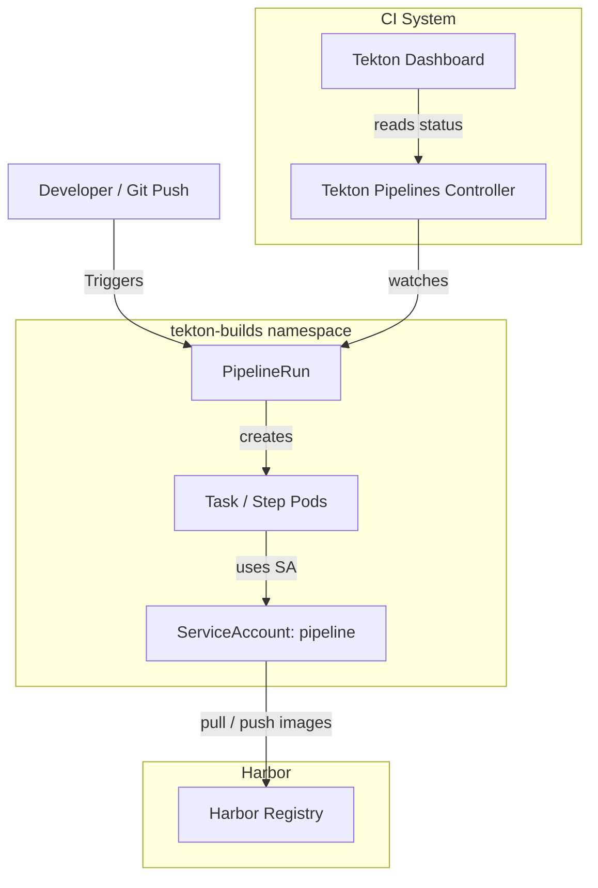

# Tekton Quick Start

This document describes how Tekton is installed and structured in this cluster, and how CI build workloads are expected to run.

---

## Overview

The cluster runs **Tekton Pipelines** as the CI engine, integrated with:

* Istio (ambient mode) for ingress
* Gateway API + HTTPRoute for UI exposure
* Harbor as the container registry
* Pod Security Admission (PSA) for workload hardening

A strict separation is maintained between:

* **Control plane** (`tekton-pipelines` namespace)
* **Build workloads** (`tekton-builds` namespace)

---

## Architecture



---

## Namespaces

### tekton-pipelines

Purpose:

* Hosts Tekton controllers and system components

Characteristics:

* No build workloads should run here
* Controllers only
* `set-security-context=true` enabled via feature-flags

---

### tekton-builds

Purpose:

* Runs all CI build workloads

Security:

* Pod Security Admission: **baseline**
* Explicit ServiceAccount usage
* No privileged pods allowed

Labels:

```yaml
pod-security.kubernetes.io/enforce: baseline
pod-security.kubernetes.io/audit: baseline
pod-security.kubernetes.io/warn: baseline
```

---

## Registry Access (Harbor)

A Docker registry secret is created in `tekton-builds`:

* Secret name: `harbor-registry`
* Type: `kubernetes.io/dockerconfigjson`

The secret is attached to the `pipeline` ServiceAccount so that:

* Task images can be pulled
* Built images can be pushed to Harbor

---

## ServiceAccount Model

Each namespace has its own ServiceAccount scope.

### tekton-builds/pipeline

This is the **important one**.

Responsibilities:

* Used by all `PipelineRun`s
* References `harbor-registry` via `imagePullSecrets`

Example:

```yaml
apiVersion: v1
kind: ServiceAccount
metadata:
  name: pipeline
  namespace: tekton-builds
imagePullSecrets:
  - name: harbor-registry
```

---

## Security Context Handling

Tekton is configured with:

```yaml
set-security-context: "true"
```

This ensures:

* `securityContext` defined in Tasks is honored
* PSA enforcement works as expected
* Builds behave consistently across environments

---

## Dashboard Access

The Tekton Dashboard is:

* Installed after Tekton CRDs are established
* Exposed via Istio Gateway and HTTPRoute
* Accessible at:

```
https://tekton.local
```

---

## Running a Pipeline

Expected flow:

1. A `PipelineRun` is created in `tekton-builds`
2. Tekton controller reconciles it
3. Task Pods are created using the `pipeline` ServiceAccount
4. Images are pulled/pushed to Harbor
5. Status is visible in the Dashboard

---

## Best Practices

* Always run builds in `tekton-builds`
* Never weaken PSA for this namespace
* Create a separate namespace if privileged builds are ever required
* Explicitly set `serviceAccountName` in `PipelineRun`s

---

## Summary

This setup provides:

* Clear separation of concerns
* Secure-by-default CI workloads
* Predictable Tekton behavior
* Compatibility with PSA, Istio, and Harbor

It is suitable for both local development and production-style environments.
