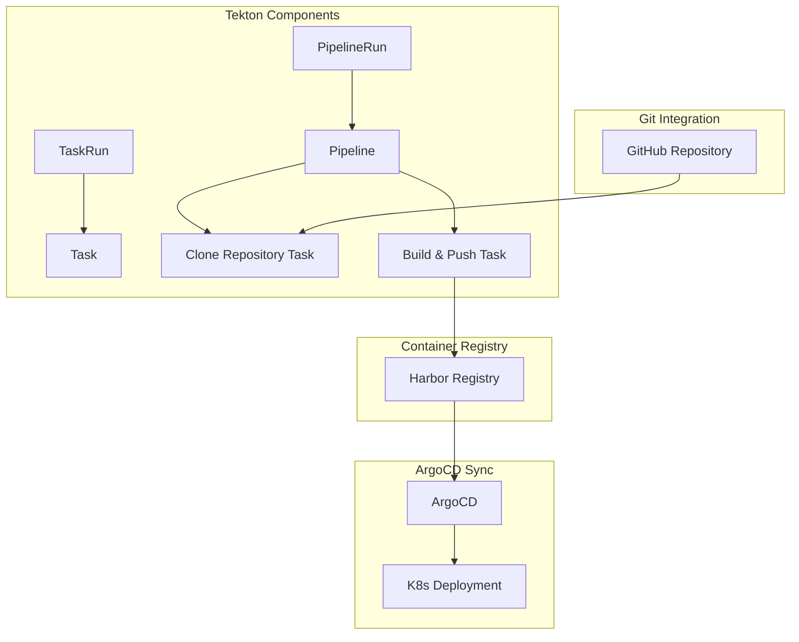
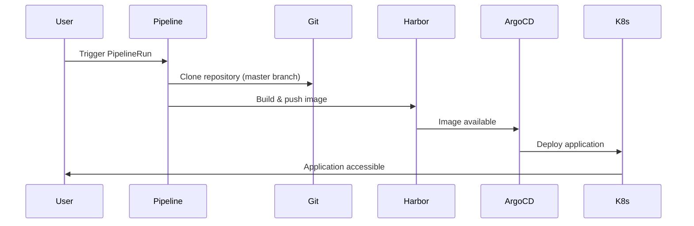

# Tekton CI/CD Pipeline Quick Start

## Overview
Tekton provides Kubernetes-native CI/CD pipeline capabilities with reusable tasks and pipeline definitions. This setup demonstrates continuous integration and deployment workflows.

## Architecture


## Pipeline Workflow


## Quick Start

### 1. Deploy Pipeline Components
```bash
kubectl apply -f Tekton-Pipelines/
```

### 2. Trigger Pipeline
```bash
kubectl create -f Tekton-Pipelines/tekton-pipeline-run.yaml
```

### 3. Monitor Pipeline
```bash
kubectl get pipelineruns -n tekton-builds
kubectl logs -f pipelinerun/demo-app-pipeline-run -n tekton-builds
```

## Pipeline Components
- **Clone Task**: Fetches source code from GitHub repository
- **Build Task**: Builds Docker image and pushes to Harbor registry
- **ServiceAccount**: Provides required permissions for pipeline execution

## Integration Points
- **Git Repository**: Source code location (master branch)
- **Harbor Registry**: Container image storage at `harbor.local`
- **ArgoCD**: Automated deployment synchronization
- **Istio Gateway**: HTTPS access at `https://demo-app1.local`
