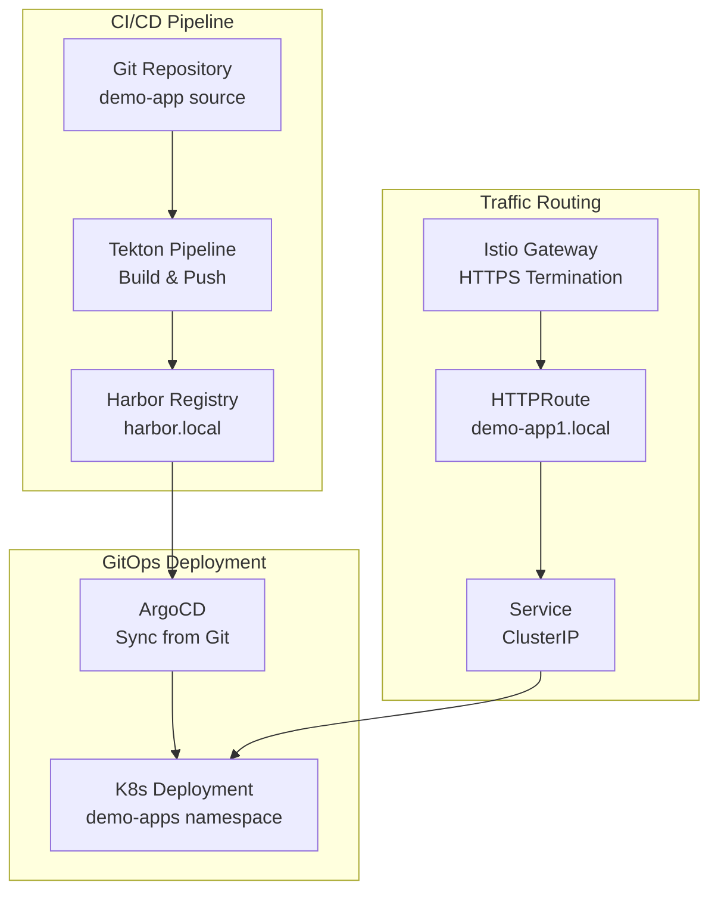

# Demo Application Quick Start

## Overview
Simple nginx-based demo application deployed via GitOps with Tekton CI/CD pipeline.

## Architecture


## Access
- **URL**: https://demo-app1.local
- **Content**: "Hello from Tekton" HTML page

## Pipeline
```bash
kubectl create -f Tekton-Pipelines/tekton-pipeline-run.yaml
kubectl get pipelineruns -n tekton-builds
```

## Components
- **Namespace**: demo-apps
- **Image**: harbor.local/library/demo-app:latest
- **Replicas**: 2
- **Resources**: 100m CPU, 128Mi memory