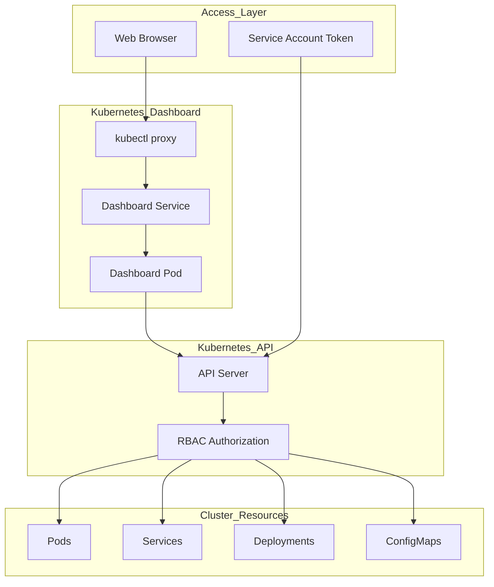

# Kubernetes Dashboard Quick Start

Web-based UI for managing and monitoring the Kubernetes cluster.

## Architecture



## Installation

### 1. Deploy Dashboard
```bash
kubectl apply -f https://raw.githubusercontent.com/kubernetes/dashboard/v2.7.0/aio/deploy/recommended.yaml
```

### 2. Create Admin Service Account
```yaml
apiVersion: v1
kind: ServiceAccount
metadata:
  name: admin-user
  namespace: kubernetes-dashboard
---
apiVersion: rbac.authorization.k8s.io/v1
kind: ClusterRoleBinding
metadata:
  name: admin-user
roleRef:
  apiGroup: rbac.authorization.k8s.io
  kind: ClusterRole
  name: cluster-admin
subjects:
- kind: ServiceAccount
  name: admin-user
  namespace: kubernetes-dashboard
```

### 3. Generate Access Token
```bash
kubectl -n kubernetes-dashboard create token admin-user
```

## Access Methods

### Method 1: kubectl proxy (Recommended)
```bash
# Start proxy
kubectl proxy

# Access dashboard at:
# http://localhost:8001/api/v1/namespaces/kubernetes-dashboard/services/https:kubernetes-dashboard:/proxy/
```

### Method 2: Port Forward
```bash
# Port forward to dashboard service
kubectl -n kubernetes-dashboard port-forward svc/kubernetes-dashboard 8443:443

# Access at: https://localhost:8443
```

### Method 3: NodePort (Development only)
```yaml
apiVersion: v1
kind: Service
metadata:
  name: kubernetes-dashboard-nodeport
  namespace: kubernetes-dashboard
spec:
  type: NodePort
  selector:
    k8s-app: kubernetes-dashboard
  ports:
  - port: 443
    targetPort: 8443
    nodePort: 32000
```

## Authentication

### Token-based Login
1. Copy the token generated from service account
2. Select "Token" option on dashboard login page
3. Paste token and click "Sign in"

### Kubeconfig Login
1. Use your local kubeconfig file
2. Select "Kubeconfig" option on dashboard login page  
3. Upload or paste kubeconfig content

## Dashboard Features

### Resource Management
- **Workloads**: View and manage Deployments, Pods, ReplicaSets
- **Services**: Manage Services, Ingresses, Network Policies  
- **Storage**: Handle PersistentVolumes, PersistentVolumeClaims
- **Config**: Manage ConfigMaps, Secrets

### Monitoring & Logs
- **Pod Metrics**: CPU and memory usage graphs
- **Event Logs**: Real-time cluster events
- **Pod Logs**: View container logs directly in UI
- **Resource Scaling**: Scale deployments via UI

### Security Features
- **RBAC Viewer**: Visualize role bindings and permissions
- **Service Account Management**: Create and manage service accounts
- **Network Policies**: Configure pod-to-pod communication rules

## Common Tasks

### Scale Deployment
1. Navigate to Workloads → Deployments
2. Click on deployment name
3. Click "Scale" button
4. Adjust replica count
5. Click "Update"

### View Pod Logs
1. Go to Workloads → Pods
2. Click on pod name
3. Click "Logs" tab
4. Select container if multiple exist

### Edit Resource
1. Navigate to resource
2. Click "Edit" button (pencil icon)
3. Modify YAML content
4. Click "Update"

### Create Resource
1. Click "+" button in top navigation
2. Choose "Create from input" or "Create from file"
3. Paste YAML content or upload file
4. Click "Upload"

## Security Considerations

### Least Privilege Access
```yaml
# Limited dashboard user example
apiVersion: v1
kind: ServiceAccount
metadata:
  name: dashboard-viewonly
  namespace: kubernetes-dashboard
---
apiVersion: rbac.authorization.k8s.io/v1
kind: ClusterRoleBinding
metadata:
  name: dashboard-viewonly
roleRef:
  apiGroup: rbac.authorization.k8s.io
  kind: ClusterRole
  name: view
subjects:
- kind: ServiceAccount
  name: dashboard-viewonly
  namespace: kubernetes-dashboard
```

### Network Security
- Use kubectl proxy instead of exposing dashboard publicly
- Configure firewall rules for NodePort access
- Enable TLS encryption for all connections
- Regularly rotate service account tokens

## Troubleshooting

### Cannot Access Dashboard
```bash
# Check dashboard pods
kubectl get pods -n kubernetes-dashboard

# Check service status
kubectl get svc -n kubernetes-dashboard

# View dashboard logs
kubectl logs -n kubernetes-dashboard -l k8s-app=kubernetes-dashboard
```

### Token Expired
```bash
# Generate new token
kubectl -n kubernetes-dashboard create token admin-user

# Check token expiration
kubectl -n kubernetes-dashboard get secrets
```

### Permission Denied
```bash
# Check service account permissions
kubectl auth can-i --list --as=system:serviceaccount:kubernetes-dashboard:admin-user

# Verify cluster role binding
kubectl get clusterrolebinding admin-user -o yaml
```

## Best Practices

- Use service accounts with minimal required permissions
- Regularly rotate access tokens
- Enable audit logging for dashboard access
- Use kubectl proxy for secure local access
- Monitor dashboard access logs
- Keep dashboard version updated
- Use namespaced access where possible