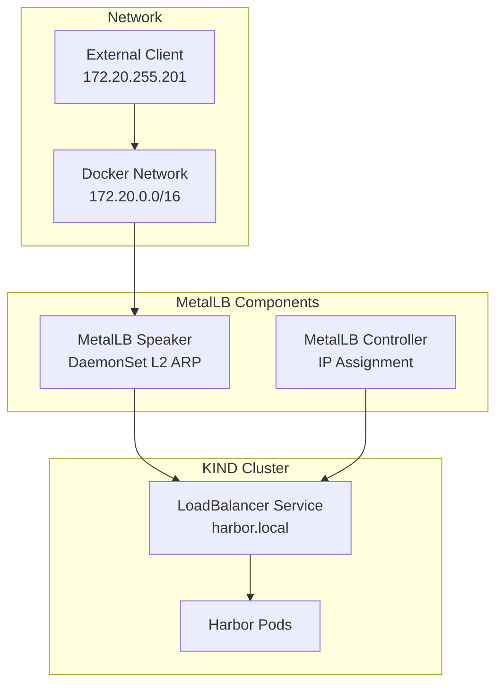

# MetalLB Load Balancer Quick Start

## Overview
MetalLB provides LoadBalancer services in bare-metal Kubernetes clusters using L2/BGP protocols.

## Architecture


## Installation
```bash
kubectl apply -f https://raw.githubusercontent.com/metallb/metallb/v0.14.5/config/manifests/metallb-native.yaml
kubectl apply -f metalLB/metallb-config.yaml
```

## Configuration
IP Pool: `172.20.255.200-172.20.255.250`

## Verification
```bash
kubectl get svc -n istio-gateway
kubectl get ipaddresspools -n metallb-system
```