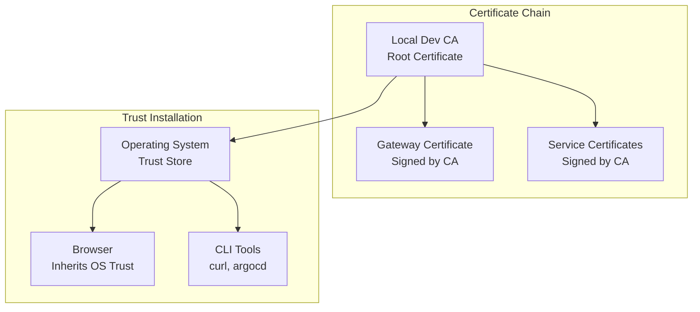
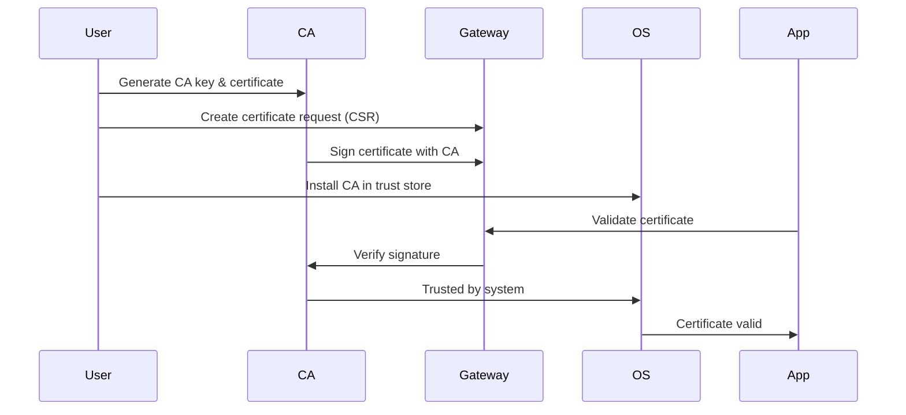

# Local Certificate Authority for TLS Development

## Overview
Creates a local Certificate Authority (CA) for development environments, eliminating browser security warnings and enabling production-like TLS workflows.

## Certificate Architecture


## Certificate Creation Process


## Implementation Steps

### 1. Generate Certificate Authority
```bash
# Create CA private key
openssl genrsa -out tls/ca.key 4096

# Create CA certificate
openssl req -x509 -new -nodes \
  -key tls/ca.key \
  -sha256 -days 365 \
  -out tls/ca.crt \
  -subj "/CN=Local Dev CA"
```

### 2. Create Gateway Certificate Request
```bash
openssl req -new \
  -newkey rsa:2048 \
  -nodes \
  -keyout tls/key.pem \
  -out tls/gateway.csr \
  -config tls/openssl-local.cnf
```

### 3. Sign Certificate with CA
```bash
openssl x509 -req \
  -in tls/gateway.csr \
  -CA tls/ca.crt \
  -CAkey tls/ca.key \
  -CAcreateserial \
  -out tls/cert.pem \
  -days 365 \
  -sha256 \
  -extensions req_ext \
  -extfile tls/openssl-local.cnf
```

### 4. Verify Certificate Chain
```bash
# Check Subject Alternative Names
openssl x509 -in tls/cert.pem -noout -text | grep -A2 "Subject Alternative Name"

# Verify certificate chain
openssl verify -CAfile tls/ca.crt tls/cert.pem
```

### 5. Install CA in System Trust Store

#### Linux
```bash
sudo cp tls/ca.crt /usr/local/share/ca-certificates/local-dev-ca.crt
sudo update-ca-certificates
```

#### macOS
```bash
sudo security add-trusted-cert \
  -d -r trustRoot \
  -k /Library/Keychains/System.keychain \
  tls/ca.crt
```

### 6. Deploy Certificate to Kubernetes
```bash
kubectl create secret tls istio-gateway-credentials \
  --cert=tls/cert.pem \
  --key=tls/key.pem \
  -n istio-gateway \
  --dry-run=client -o yaml | kubectl apply -f -

kubectl rollout restart deployment/istio-ingressgateway -n istio-gateway
```

## Verification

### Test HTTPS Connection
```bash
curl -v https://demo-app1.local
# Should show: SSL certificate verify ok
```

### Test ArgoCD Login
```bash
PASSWORD=$(kubectl -n argocd get secret argocd-initial-admin-secret -o jsonpath="{.data.password}" | base64 -d)

argocd login argocd.local \
  --username admin \
  --password "$PASSWORD" \
  --grpc-web
```

## Security Benefits
- **Production-like Trust Chain**: Matches real-world certificate validation
- **No Browser Warnings**: Clean HTTPS experience in development
- **Tool Compatibility**: CLI tools work without `--insecure` flags
- **Development Best Practices**: Encourages proper TLS handling

## Current Configuration
- **Domains**: `*.local`, `localhost`
- **Validity**: 365 days
- **Algorithm**: RSA 2048-bit with SHA256
- **Extensions**: Subject Alternative Names for multi-domain support
  -keyout tls/key.pem \
  -out tls/gateway.csr \
  -config tls/openssl-local.cnf
```

***This creates:***

```yaml
key.pem → gateway private key

gateway.csr → “please sign me” request
```

## Step 3 — Sign the gateway cert with your CA

***This is the magic step.***

```sh
openssl x509 -req \
  -in tls/gateway.csr \
  -CA tls/ca.crt \
  -CAkey tls/ca.key \
  -CAcreateserial \
  -out tls/cert.pem \
  -days 365 \
  -sha256 \
  -extensions req_ext \
  -extfile tls/openssl-local.cnf
```

***Results:***

```yaml
cert.pem → gateway certificate signed by your CA

cert.pem is NOT self-signed

It is signed by your CA

SANs still apply (*.local, localhost)
```

## Step 4 — Verify (always verify)

```sh
openssl x509 -in tls/cert.pem -noout -text | grep -A2 "Subject Alternative Name"
```

***You should see:***

  ```yaml
DNS:*.local, DNS:localhost
```

***And verify the chain:***

```sh
openssl verify -CAfile tls/ca.crt tls/cert.pem
```

***Expected:***

tls/cert.pem: OK

## Step 5 — Trust the CA on your machine

This is what removes the prompt.

***On Linux (most distros)***

```sh
# This will copy the CA cert to the trusted store
sudo cp tls/ca.crt /usr/local/share/ca-certificates/local-dev-ca.crt
# Update the trusted certificates
sudo update-ca-certificates
```

***On macOS***

```sh
sudo security add-trusted-cert \
  -d -r trustRoot \
  -k /Library/Keychains/System.keychain \
  tls/ca.crt
```

***After this:***

```yaml
Your OS trusts anything signed by your CA

Browsers, curl, argocd CLI all inherit this
```

## Step 6 — Deploy cert to Istio Gateway

## Create or update the TLS secret

```sh

kubectl create secret tls istio-gateway-credentials \
  --cert=tls/cert.pem \
  --key=tls/key.pem \
  -n istio-gateway \
  --dry-run=client -o yaml | kubectl apply -f -

kubectl rollout restart deployment/istio-ingressgateway -n istio-gateway
```

## Step 7 — Test (this is the payoff)

```sh
PASSWORD=$(kubectl -n argocd get secret argocd-initial-admin-secret -o jsonpath="{.data.password}" | base64 -d)

argocd login argocd.local \
  --username admin \
  --password "$PASSWORD" \
  --grpc-web
```

***Expected:***
✔️ No prompt
✔️ No --insecure
✔️ Full TLS validation
