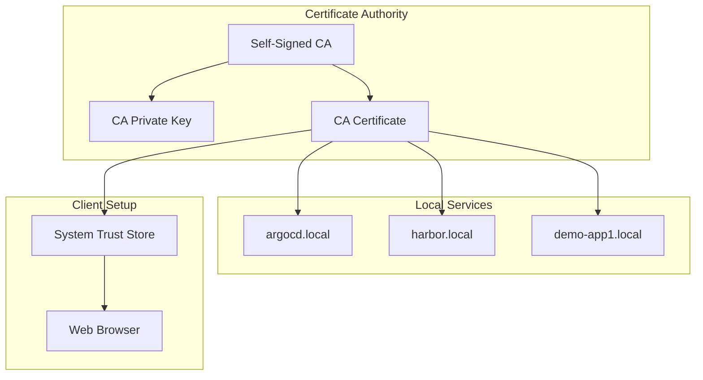

# TLS Certificate Management

Self-signed certificate authority for local HTTPS services in the GitOps platform.

## Architecture



## Quick Start

1. **Generate CA Certificate**
   ```bash
   # Create CA private key
   openssl genrsa -out ca-key.pem 4096
   
   # Create CA certificate
   openssl req -new -x509 -days 365 -key ca-key.pem -out ca-cert.pem \
     -subj "/C=US/ST=State/L=City/O=Organization/CN=Local CA"
   ```

2. **Create Service Certificates**
   ```bash
   # Generate service private key
   openssl genrsa -out tls-key.pem 2048
   
   # Generate certificate signing request
   openssl req -new -key tls-key.pem -out tls.csr \
     -config openssl-local.cnf
   
   # Sign certificate with CA
   openssl x509 -req -in tls.csr -CA ca-cert.pem -CAkey ca-key.pem \
     -CAcreateserial -out tls-cert.pem -days 365 \
     -extensions v3_req -extfile openssl-local.cnf
   ```

## Configuration

The [openssl-local.cnf](openssl-local.cnf) includes SAN entries for all local services:
- argocd.local
- harbor.local  
- demo-app1.local

## Trust Installation

**macOS**
```bash
sudo security add-trusted-cert -d -r trustRoot -k /Library/Keychains/System.keychain ca-cert.pem
```

**Linux**
```bash
sudo cp ca-cert.pem /usr/local/share/ca-certificates/local-ca.crt
sudo update-ca-certificates
```

**Windows**
```bash
certlm.msc # Import ca-cert.pem to Trusted Root Certification Authorities
```

## Files

- `ca.srl`: Certificate serial number tracker
- `openssl-local.cnf`: OpenSSL configuration with SAN extensions  
- Generated certificates stored as Kubernetes secrets

📚 Docs

***How to create proper TLS certificates for Kubernetes***

[TSL Secrets](https://kubernetes.io/docs/concepts/configuration/secret/#tls-secrets)

[Kubernetes Gateway API](https://istio.io/latest/docs/tasks/traffic-management/ingress/gateway-api/)

```sh
openssl req -x509 -nodes -days 365 \
  -newkey rsa:2048 \
  -keyout key.pem \
  -out cert.pem \
  -config openssl-local.cnf \
  -extensions req_ext
```

## Verify the certificate (important habit)

```sh
openssl x509 -in cert.pem -noout -text | grep -A1 "Subject Alternative Name"
```

## Deploy secret

```sh  
kubectl create secret tls istio-gateway-credentials \
  --cert=cert.pem \
  --key=key.pem \
  -n istio-gateway \
  --dry-run=client -o yaml | kubectl apply -f -
```

