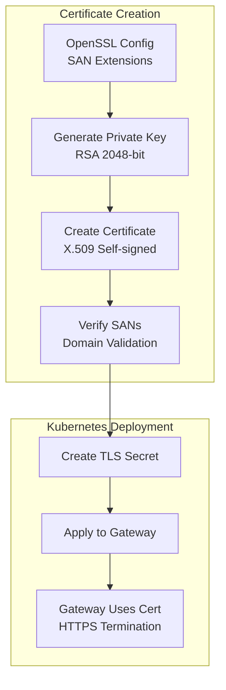

# TLS Certificate Configuration

## Overview
TLS certificate setup for Kubernetes gateways using OpenSSL with proper Subject Alternative Names (SANs) for local development domains.

## Certificate Generation Process


## Certificate Generation

### Create Certificate with SANs
```bash
openssl req -x509 -nodes -days 365 \
  -newkey rsa:2048 \
  -keyout key.pem \
  -out cert.pem \
  -config openssl-local.cnf \
  -extensions req_ext
```

### Verify Certificate SANs
```bash
openssl x509 -in cert.pem -noout -text | grep -A1 "Subject Alternative Name"
```

**Expected Output:**
```
X509v3 Subject Alternative Name:
    DNS:*.local, DNS:localhost
```

## Kubernetes Deployment

### Create TLS Secret
```bash
kubectl create secret tls istio-gateway-credentials \
  --cert=cert.pem \
  --key=key.pem \
  -n istio-gateway
```

### Verify Secret
```bash
kubectl get secret istio-gateway-credentials -n istio-gateway -o yaml
```

## OpenSSL Configuration
File: `openssl-local.cnf`
```ini
[req]
distinguished_name = req_distinguished_name
req_extensions = req_ext

[req_distinguished_name]

[req_ext]
subjectAltName = @alt_names

[alt_names]
DNS.1 = *.local
DNS.2 = localhost
```

## Current Setup
- **Certificate Type**: X.509 self-signed
- **Key Algorithm**: RSA 2048-bit
- **Validity**: 365 days
- **Domains**: `*.local`, `localhost`
- **Usage**: Istio Gateway TLS termination

## References
- [Kubernetes TLS Secrets](https://kubernetes.io/docs/concepts/configuration/secret/#tls-secrets)
- [Istio Gateway API](https://istio.io/latest/docs/tasks/traffic-management/ingress/gateway-api/)
  --key=key.pem \
  -n istio-gateway \
  --dry-run=client -o yaml | kubectl apply -f -
```

