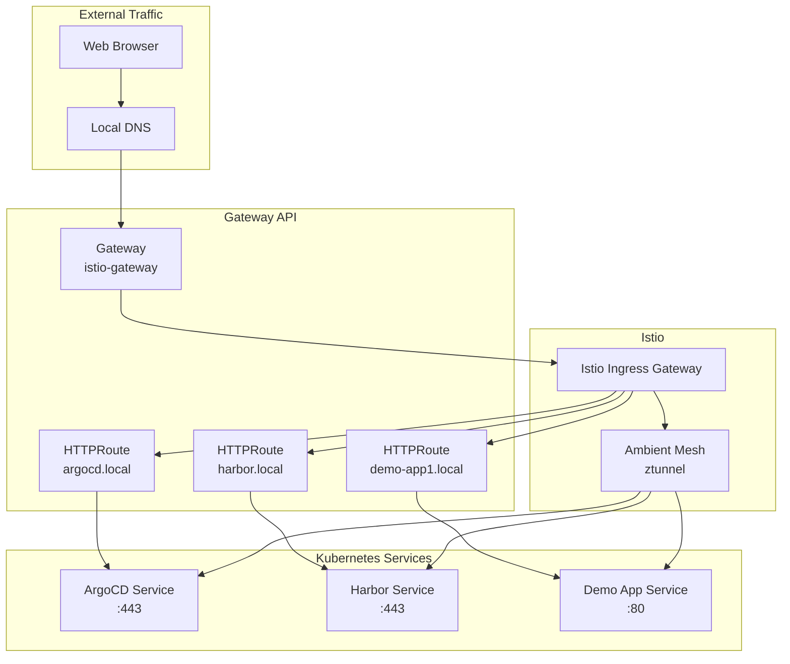

# Gateway API Implementation Guide

Modern ingress and traffic management using Kubernetes Gateway API with Istio.

## Architecture  



## Gateway Configuration

### Main Gateway Definition
```yaml
apiVersion: gateway.networking.k8s.io/v1
kind: Gateway
metadata:
  name: istio-gateway
  namespace: istio-system
spec:
  gatewayClassName: istio
  listeners:
  - name: https
    hostname: "*.local"
    port: 443
    protocol: HTTPS
    tls:
      mode: Terminate
      certificateRefs:
      - name: local-certs
        namespace: istio-system
  - name: http
    hostname: "*.local"  
    port: 80
    protocol: HTTP
```

### HTTPRoute Examples

**ArgoCD Route**
```yaml
apiVersion: gateway.networking.k8s.io/v1
kind: HTTPRoute
metadata:
  name: argocd-route
  namespace: argocd
spec:
  parentRefs:
  - name: istio-gateway
    namespace: istio-system
  hostnames:
  - "argocd.local"
  rules:
  - matches:
    - path:
        type: PathPrefix
        value: /
    backendRefs:
    - name: argocd-server
      port: 443
```

**Harbor Route**
```yaml
apiVersion: gateway.networking.k8s.io/v1
kind: HTTPRoute  
metadata:
  name: harbor-route
  namespace: harbor
spec:
  parentRefs:
  - name: istio-gateway
    namespace: istio-system
  hostnames:
  - "harbor.local"
  rules:
  - matches:
    - path:
        type: PathPrefix
        value: /
    backendRefs:
    - name: harbor-portal
      port: 80
```

**Demo Application Route**
```yaml
apiVersion: gateway.networking.k8s.io/v1
kind: HTTPRoute
metadata:
  name: demo-route
  namespace: default
spec:
  parentRefs:
  - name: istio-gateway
    namespace: istio-system
  hostnames:
  - "demo-app1.local"
  rules:
  - matches:
    - path:
        type: PathPrefix
        value: /
    backendRefs:
    - name: demo-app-service
      port: 80
```

## TLS Configuration

### Certificate Secret
```yaml
apiVersion: v1
kind: Secret
metadata:
  name: local-certs
  namespace: istio-system
type: kubernetes.io/tls
data:
  tls.crt: <base64-encoded-cert>
  tls.key: <base64-encoded-key>
```

### Trust Chain Setup
1. Generate self-signed CA certificate
2. Create service certificates signed by CA
3. Install CA in system trust store
4. Configure Gateway with certificate secret

## Traffic Management

### Load Balancing
- **Round Robin**: Default algorithm for multiple backends
- **Session Affinity**: Available via service annotations
- **Weighted Routing**: Configure via HTTPRoute rules

### Header Manipulation
```yaml
filters:
- type: RequestHeaderModifier
  requestHeaderModifier:
    set:
    - name: X-Forwarded-Proto
      value: https
    add:
    - name: X-Custom-Header
      value: gateway-api
    remove:
    - name: X-Internal-Header
```

### Path Rewriting
```yaml
filters:
- type: URLRewrite
  urlRewrite:
    path:
      type: ReplaceFullPath
      replaceFullPath: /new-path
```

## Monitoring

### Gateway Status
```bash
# Check gateway status
kubectl get gateway -A

# Verify HTTPRoute binding
kubectl get httproute -A

# Check gateway controller logs
kubectl logs -n istio-system -l app=istiod
```

### Service Access
```bash
# Test HTTP access
curl -H "Host: demo-app1.local" http://172.20.255.200/

# Test HTTPS access  
curl -k -H "Host: argocd.local" https://172.20.255.200/
```

## Troubleshooting

### Common Issues

1. **503 Service Unavailable**
   - Check backend service endpoints
   - Verify service port configuration
   - Confirm pod readiness

2. **TLS Certificate Errors**
   - Validate certificate chain
   - Check certificate expiration
   - Verify SAN entries include hostname

3. **DNS Resolution**
   - Add entries to `/etc/hosts`:
     ```
     172.20.255.200 argocd.local
     172.20.255.200 harbor.local
     172.20.255.200 demo-app1.local
     ```

### Debug Commands
```bash
# Check Istio gateway configuration
istioctl proxy-config listener <gateway-pod> -n istio-system

# Verify route configuration
istioctl proxy-config route <gateway-pod> -n istio-system

# Check certificate configuration
kubectl get secret local-certs -n istio-system -o yaml
```

## Best Practices

- Use namespace-scoped HTTPRoutes for better isolation
- Implement proper RBAC for Gateway API resources  
- Configure rate limiting and security policies
- Monitor gateway metrics with Prometheus
- Use descriptive names for routes and gateways
- Validate configurations with dry-run before applying