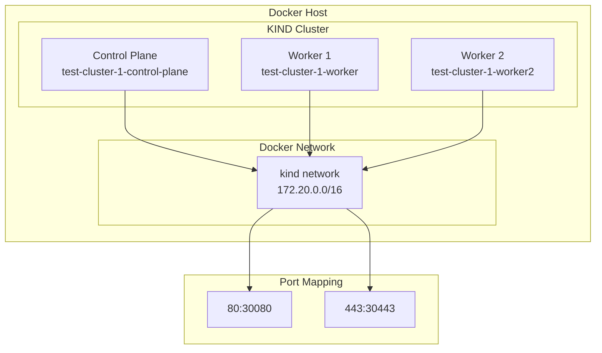

# KIND Cluster Configuration

## Overview
KIND (Kubernetes IN Docker) provides local Kubernetes clusters using Docker containers as nodes.

## Architecture


## Configuration
- **Cluster Name**: test-cluster-1  
- **Node Count**: 3 (1 control-plane, 2 workers)
- **Network**: 172.20.0.0/16
- **Port Mapping**: 80/443 for ingress

## Creation
```bash
kind create cluster --config=kind-config.yaml
```

## Management  
```bash
kubectl get nodes
kind get clusters
kind delete cluster --name test-cluster-1
```