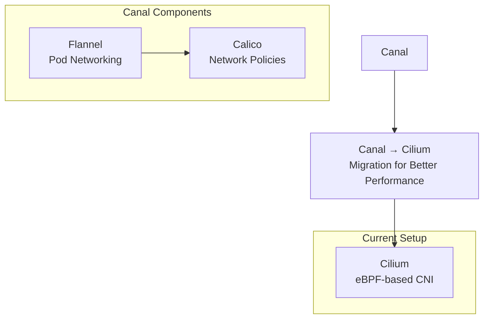

# Canal CNI Alternative

## Overview
Canal combines Flannel networking with Calico network policies, providing basic CNI functionality. This setup uses Cilium instead for enhanced eBPF capabilities.

## Architecture


## Canal Installation (Reference Only)
```bash
cd /tmp
curl https://raw.githubusercontent.com/projectcalico/calico/v3.30.3/manifests/canal.yaml -O
kubectl apply -f canal.yaml
```

## Why Cilium Instead?
- **eBPF Performance**: Kernel-level networking without iptables overhead
- **kube-proxy Replacement**: Native load balancing
- **Advanced Observability**: Hubble network monitoring
- **Service Mesh**: Built-in L7 proxy capabilities
- **Better Security**: Identity-based network policies

## Migration Benefits
- Reduced latency and improved throughput
- Simplified network stack
- Enhanced troubleshooting capabilities
- Future-proof networking architecture
