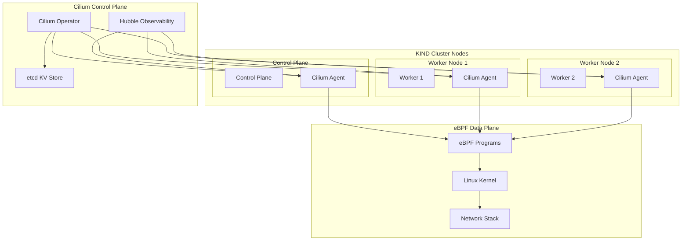

# Cilium CNI Installation Guide

eBPF-powered networking and security for Kubernetes with advanced observability.

## Architecture



## Installation

1. **Install Cilium CLI**
   ```bash
   curl -L --remote-name-all https://github.com/cilium/cilium-cli/releases/latest/download/cilium-linux-amd64.tar.gz{,.sha256sum}
   sha256sum --check cilium-linux-amd64.tar.gz.sha256sum
   tar xzvf cilium-linux-amd64.tar.gz
   sudo mv cilium /usr/local/bin
   ```

2. **Deploy Cilium to Cluster**
   ```bash
   cilium install
   cilium status
   ```

3. **Enable Hubble Observability**
   ```bash
   cilium hubble enable
   ```

4. **Install Hubble CLI**
curl -L --fail --remote-name-all https://github.com/cilium/hubble/releases/download/$HUBBLE_VERSION/hubble-linux-${HUBBLE_ARCH}.tar.gz{,.sha256sum}
sha256sum --check hubble-linux-${HUBBLE_ARCH}.tar.gz.sha256sum
sudo tar xzvfC hubble-linux-${HUBBLE_ARCH}.tar.gz /usr/local/bin
rm hubble-linux-${HUBBLE_ARCH}.tar.gz{,.sha256sum}
```

* Activate UI

```sh
cilium hubble enable --relay --ui
kubectl -n kube-system port-forward svc/hubble-ui 12000:80
http://localhost:12000/
```

## What you just did

* svc/hubble-ui → This is the Kubernetes Service that fronts the Hubble UI deployment.

* That UI is just a simple web server running in the pod, serving the React/JS dashboard on port 80.

* When you port-forward 12000:80, traffic on localhost:12000 is tunneled into the pod’s port 80 → the UI loads fine in your browser.

* So: UI == plain HTTP server → easy to forward, no special protocol issues.

## Why hubble-relay was failing?

* The Relay is not a simple HTTP server.

* It exposes a gRPC endpoint on port 4245 (internally named grpc).

* The hubble-relay Service remaps that to port 80, so you’re supposed to forward 4245:80.

## The trouble is

* gRPC is binary, not plain HTTP. If you try to “curl” it, you’ll just see resets.

* The hubble CLI must speak the correct protocol. If the CLI expects TLS but relay was deployed without TLS (common in kind/dev), or vice versa, the connection is rejected.

* That’s why you kept seeing:

```sh
connection reset by peer
connection refused
```

* the relay was either not listening yet, or your client was speaking the wrong protocol (TLS vs no TLS).

## Why the UI just works

* The UI container makes its own connection to the Relay inside the cluster (service-to-service).

* Your browser never speaks to the relay directly — it just talks to the UI’s web server (HTTP).

* The UI then proxies your requests to relay using the correct gRPC settings.

* So:

* Port-forward UI → browser → UI pod → Relay pod → Cilium agents → Flows ✅

* Port-forward Relay directly → CLI → Relay pod ❌ (you hit protocol/TLS mismatches).

## Summary

* hubble-ui works with port-forward because it’s plain HTTP on port 80.

* hubble-relay fails with port-forward because it expects gRPC, and your CLI + relay config are out of sync (TLS mismatch or port mismatch).

* The UI hides that complexity, because it already knows how to talk to Relay correctly.
