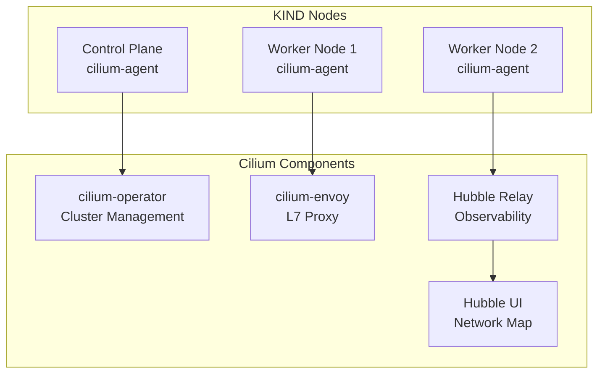

# Cilium CNI Installation Guide

## Overview
Cilium provides eBPF-based networking, security, and observability for Kubernetes with advanced features like kube-proxy replacement and network policies.

## Architecture


## Installation Steps

### 1. Install Cilium CLI
```bash
curl -L --remote-name-all https://github.com/cilium/cilium-cli/releases/latest/download/cilium-linux-amd64.tar.gz{,.sha256sum}
sha256sum --check cilium-linux-amd64.tar.gz.sha256sum
tar xzvf cilium-linux-amd64.tar.gz
sudo mv cilium /usr/local/bin
```

### 2. Deploy Cilium CNI
```bash
cilium install --set kubeProxyReplacement=true
cilium status --wait
```

### 3. Enable Hubble Observability
```bash
cilium hubble enable --relay --ui
```

### 4. Install Hubble CLI
```bash
HUBBLE_VERSION=$(curl -s https://raw.githubusercontent.com/cilium/hubble/master/stable.txt)
HUBBLE_ARCH=amd64
curl -L --fail --remote-name-all https://github.com/cilium/hubble/releases/download/$HUBBLE_VERSION/hubble-linux-${HUBBLE_ARCH}.tar.gz{,.sha256sum}
sha256sum --check hubble-linux-${HUBBLE_ARCH}.tar.gz.sha256sum
sudo tar xzvfC hubble-linux-${HUBBLE_ARCH}.tar.gz /usr/local/bin
```

## Verification

### Check Cilium Status
```bash
cilium status
cilium connectivity test
```

### Access Hubble UI
```bash
cilium hubble ui
# Access: http://localhost:12000
```

## Features Enabled
- **kube-proxy Replacement**: eBPF-based load balancing
- **Network Policies**: L3/L4/L7 security enforcement
- **Hubble Observability**: Network flow visualization
- **Service Mesh**: Native service mesh capabilities
- **BGP Support**: Integration with MetalLB

## Current Configuration
- **Version**: v1.18.4
- **Mode**: kube-proxy replacement enabled
- **IPAM**: Kubernetes host-scope IPAM
- **Encryption**: Transparent encryption available