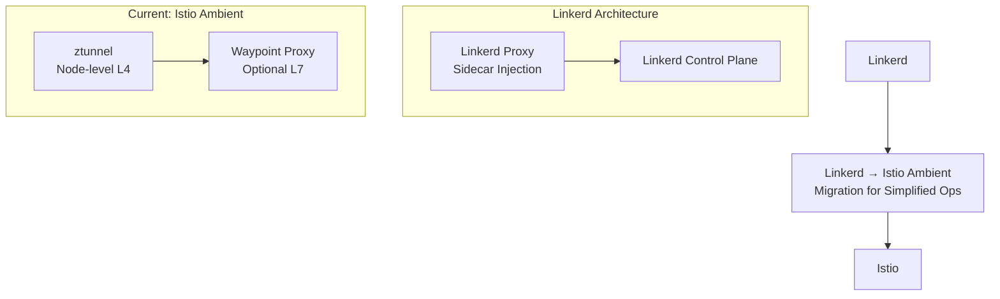

# Linkerd Service Mesh (Alternative)

## Overview
Linkerd provides a lightweight service mesh alternative to Istio. This setup uses Istio Ambient instead for better performance and simplified operations.

## Architecture Comparison


## Linkerd Installation (Reference Only)
```bash
# Install Linkerd CLI
curl -sL https://run.linkerd.io/install | sh
export PATH=$PATH:~/.linkerd2/bin

# Install Linkerd control plane
linkerd install | kubectl apply -f -
linkerd check
```

## Mesh Injection
```bash
# Inject deployment
kubectl get deploy <deployment> -n <namespace> -o yaml \
  | linkerd inject - \
  | kubectl apply -f -

# Inject namespace
kubectl annotate namespace <namespace> linkerd.io/inject=enabled
```

## Remove Linkerd Mesh
```bash
# Remove injection annotations
for ns in $(kubectl get ns -o jsonpath='{.items[*].metadata.name}'); do
  kubectl annotate ns $ns linkerd.io/inject- --overwrite
done

# Restart deployments
kubectl rollout restart deploy -n <namespace>
```

## Why Istio Ambient Instead?
- **No Sidecars**: Eliminates proxy injection complexity
- **Better Performance**: eBPF-based networking with lower latency
- **Simplified Operations**: Fewer components to manage
- **Gateway API**: Modern ingress with standard APIs
- **Cilium Integration**: Native eBPF networking stack

## Migration Benefits
- Reduced resource overhead per pod
- Simplified troubleshooting and debugging
- Better integration with Kubernetes networking
- Future-proof service mesh architecture

## Current Setup
This workspace uses **Istio v1.28.2 Ambient Mode** instead of Linkerd for service mesh capabilities.

***Delete the Linkerd namespace***

```sh
kubectl delete namespace linkerd
```

***Delete leftover CRDs***

```sh
kubectl get crd | grep linkerd | awk '{print $1}' | xargs kubectl delete crd
```

***Verify removal***

```sh
kubectl get pods -A | grep linkerd
kubectl get crd | grep linkerd
kubectl get ns | grep linkerd
```
