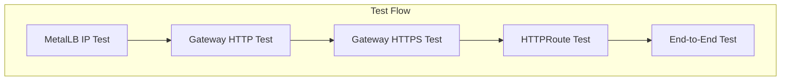

# Gateway API Testing Guide

## Overview
This guide provides systematic tests for validating Gateway API functionality with Istio Ambient Mesh, MetalLB load balancing, and HTTPS termination.

## Testing Architecture


## Test Sequence

### 1. MetalLB External IP Reachability
```bash
curl -v http://172.20.255.201
```
**Expected Result**: `HTTP/1.1 404` with `server: istio-envoy`

**Validates**:
- MetalLB IP advertisement working
- LoadBalancer Service reachable
- Envoy proxy responding to traffic

### 2. Gateway HTTP Listener
```bash
curl -v http://172.20.255.201 \
  -H "Host: demo-app1.local"
```
**Expected Result**: HTTP response or redirect to HTTPS

**Validates**:
- Gateway hostname matching
- HTTP listener configuration
- HTTPRoute attachment

### 3. Gateway HTTPS Listener
```bash
curl -v -k https://172.20.255.201 \
  -H "Host: demo-app1.local"
```
**Expected Result**: `HTTP/1.1 200` with application response

**Validates**:
- TLS termination working
- Certificate configuration
- HTTPS listener active

### 4. HTTPRoute Path Matching
```bash
curl -v -k https://demo-app1.local/
```
**Expected Result**: Application content served

**Validates**:
- DNS resolution (if hosts file configured)
- Path prefix matching
- Backend service routing

### 5. End-to-End Browser Test
Open browser to: `https://demo-app1.local`

**Validates**:
- Complete HTTPS flow
- Browser certificate handling
- Application functionality

## Troubleshooting Commands

### Gateway Status
```bash
kubectl get gateway -A
kubectl describe gateway istio-gateway -n istio-gateway
```

### HTTPRoute Status
```bash
kubectl get httproute -A
kubectl describe httproute -n demo-apps
```

### Service Status
```bash
kubectl get svc -n istio-gateway
kubectl get endpoints -A
```

### Certificate Verification
```bash
kubectl get secret istio-gateway-credentials -n istio-gateway -o yaml
```

Gateway HTTP listener is working

Hostname routing is enforced

Traffic reaches Envoy correctly

3️⃣ TLS termination works (HTTPS)
Test
curl -vk \
  --resolve istio-gateway-istio.istio-gateway:443:172.20.255.201 \
  https://istio-gateway-istio.istio-gateway/

Result
TLS handshake succeeded
server: istio-envoy

What this proved

HTTPS listener is active

TLS certificate is loaded

TLS is terminated at the Gateway

HTTP/2 is negotiated

4️⃣ HTTPRoute attachment validation
Test
kubectl describe httproute httpbin -n default

Result
Accepted: True
ResolvedRefs: True

What this proved

HTTPRoute is valid

Cross-namespace routing is allowed

Gateway accepted the route

References to Service are correct

5️⃣ Backend health (inside cluster)
Test
kubectl get pods -l app=httpbin
kubectl get endpoints httpbin

Result
Pod: Running
Endpoints: <pod-ip>:80

What this proved

Application pod is healthy

Service has active endpoints

Traffic can be forwarded upstream

6️⃣ End-to-end HTTPS routing
Test

```sh
curl -vk \
  --resolve istio-gateway-istio.istio-gateway:443:172.20.255.201 \
  https://istio-gateway-istio.istio-gateway/get
```

Result
HTTP/2 200
application/json

What this proved

Gateway → HTTPRoute → Service → Pod works

TLS → HTTP handoff is correct

L7 routing is functional

Envoy successfully proxies traffic