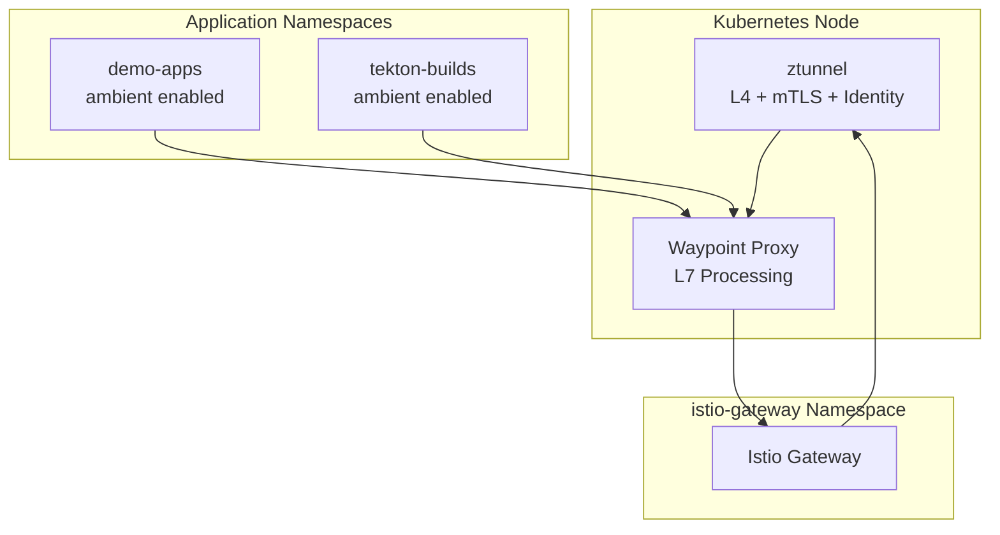
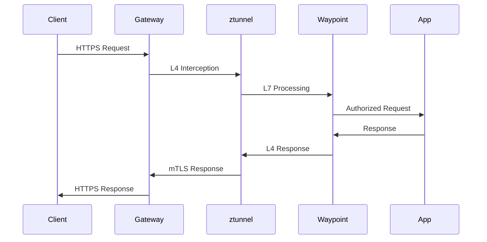
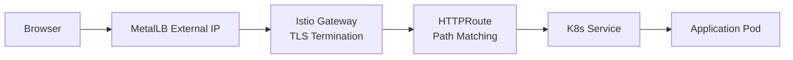

# Istio Ambient Mesh Architecture

## Overview
Istio Ambient Mesh provides service mesh capabilities without sidecar proxies, using node-level dataplane components for simplified operations and reduced resource overhead.

## Architecture Components


## Traffic Flow


## Gateway API Flow


## Namespace Configuration

### Gateway Namespace
```bash
kubectl create namespace istio-gateway
kubectl label namespace istio-gateway istio.io/dataplane-mode=ambient
```

### Application Namespaces
```bash
kubectl label namespace demo-apps istio.io/dataplane-mode=ambient
kubectl label namespace tekton-builds istio.io/dataplane-mode=ambient
```

## Key Benefits
- **No Sidecars**: Reduced resource overhead and operational complexity
- **Automatic mTLS**: Zero-trust networking without configuration
- **Selective Enablement**: Per-namespace opt-in model
- **Gateway API**: Modern ingress with Kubernetes-native configuration

## Current Setup
- **Istio Version**: v1.28.2 Ambient Mode
- **Gateway**: HTTPS termination for `demo-app1.local` and `harbor.local`
- **mTLS**: Automatic between mesh-enabled namespaces
- **Observability**: Integrated with Kubernetes metrics

## Installation Command
```bash
istioctl install \
  --set profile=ambient \
  --set 'components.ingressGateways[0].name=istio-ingressgateway' \
  --set 'components.ingressGateways[0].enabled=true' \
  --set 'components.ingressGateways[0].namespace=istio-gateway'
```