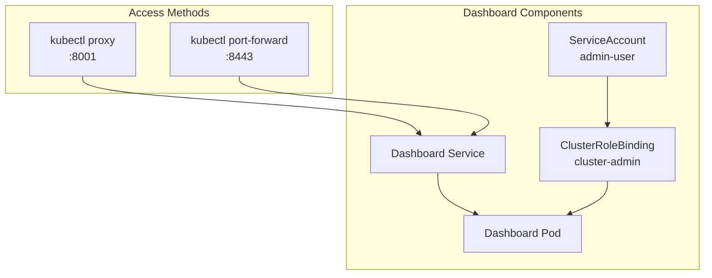

# Kubernetes Dashboard Setup

## Overview
The Kubernetes Dashboard provides a web-based UI for managing cluster resources, monitoring workloads, and troubleshooting applications.

## Architecture


## Installation

### 1. Deploy Dashboard
```bash
kubectl apply -f https://raw.githubusercontent.com/kubernetes/dashboard/v2.7.0/aio/deploy/recommended.yaml
```

### 2. Create Admin User
```bash
kubectl create serviceaccount -n kubernetes-dashboard admin-user

kubectl create clusterrolebinding admin-user-binding \
  --clusterrole cluster-admin \
  --serviceaccount=kubernetes-dashboard:admin-user
```

## Access Methods

### Option 1: kubectl proxy
```bash
kubectl proxy &
# Access: http://localhost:8001/api/v1/namespaces/kubernetes-dashboard/services/https:kubernetes-dashboard:/proxy/
```

### Option 2: Port Forward (Recommended)
```bash
kubectl port-forward -n kubernetes-dashboard service/kubernetes-dashboard 8443:443
# Access: https://localhost:8443/
```

## Authentication
```bash
kubectl -n kubernetes-dashboard create token admin-user
```

## Features
- **Resource Management**: View and manage deployments, services, pods
- **Monitoring**: Real-time resource usage and health status
- **Troubleshooting**: Access logs, events, and pod details
- **RBAC**: Role-based access control integration
