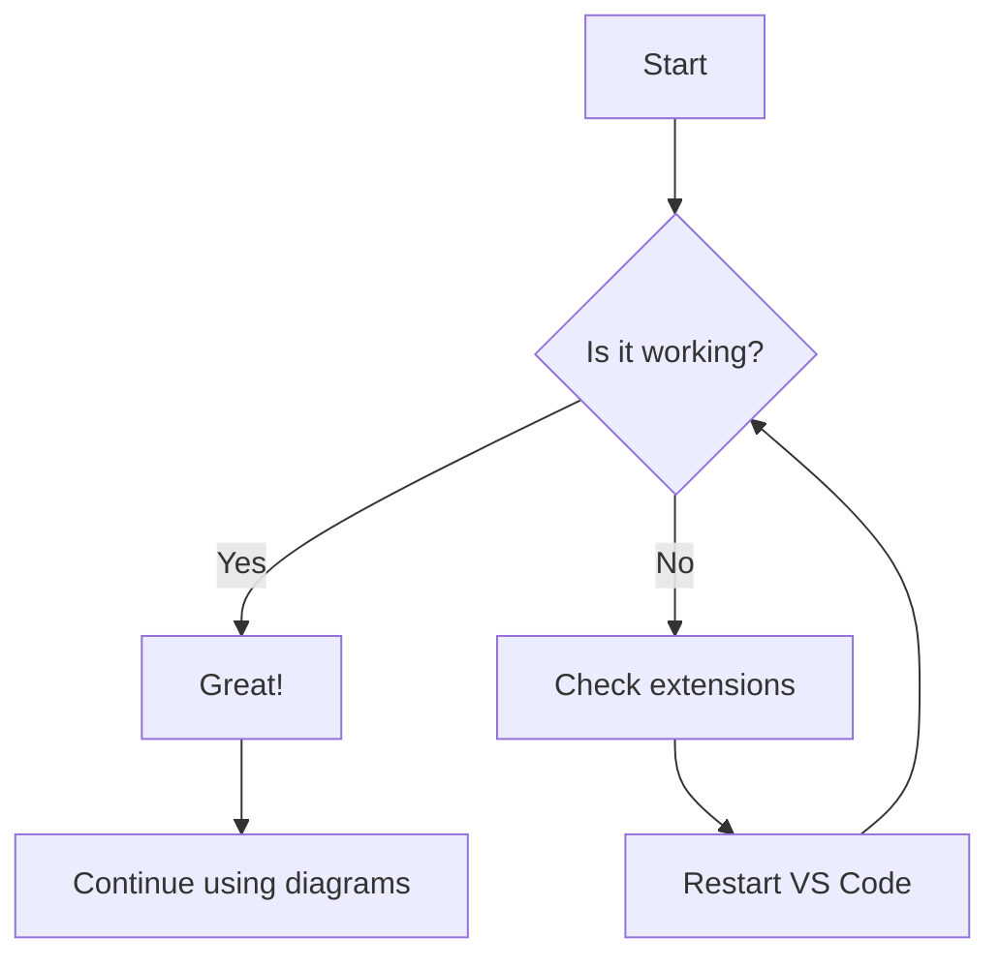
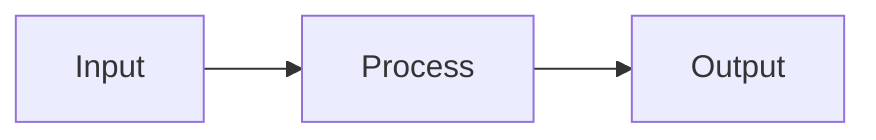

# Mermaid Test

This is a simple test to verify Mermaid rendering in VS Code.

```mermaid
graph TD
    A[Start] --> B{Is it working?}
    B -->|Yes| C[Great!]
    B -->|No| D[Check extensions]
    C --> E[Continue using diagrams]
    D --> F[Restart VS Code]
    F --> B
```

## Simple Flowchart

```mermaid
flowchart LR
    A[Input] --> B[Process] --> C[Output]
```

If you see rendered diagrams above instead of code blocks, Mermaid is working correctly!